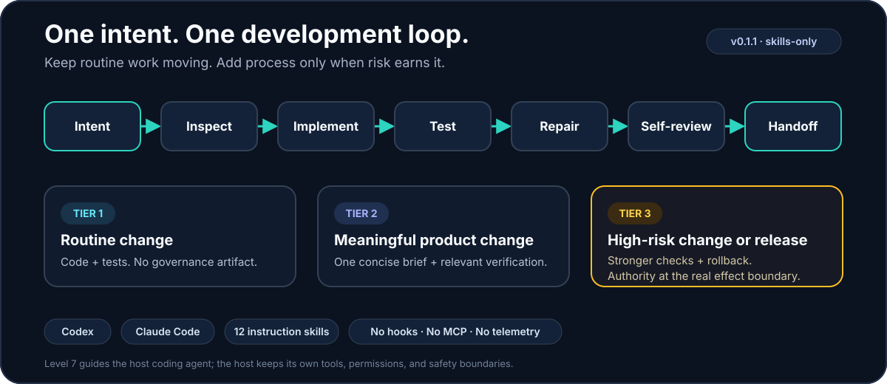

# Level 7 Dev Loop — multi-host AI development orchestration

**Level 7 Dev Loop v1 is a local-first orchestration engine for Codex, Claude
Code, and explicitly configured OpenAI Responses- or Anthropic
Messages-compatible gateways.** It discovers authenticated hosts, routes work
by verified capability and effort, maintains private codebase memory, performs
bounded security audits, and can execute durable feature waves before stopping
at the release boundary.

> **Release status:** install `v1.0.0` only from the immutable GitHub release
> when that release exists and all four attached assets verify. Until then,
> `v0.1.1` remains the stable skills-only release and rollback. Repository
> source, a workflow run, or an unsigned `1.0.0-dev` archive is not a release.

You describe the outcome. Level 7 keeps ordinary, reversible repository work
moving—and asks for your judgment only when it reaches a decision or effect
that genuinely needs you.

[Install](#install-v100) · [See how it works](#how-level-7-works) ·
[Explore the skills](#the-16-level-7-skills) ·
[Read the FAQ](#frequently-asked-questions)

<p align="center">
  <picture>
    <source media="(max-width: 640px)" srcset="docs/assets/level7-dev-loop-overview-mobile.svg">
    
  </picture>
</p>

> **The short version:** most v1 users start with `l7-onboard`, which inspects
> the project without mutation. The preserved v0.1.1 rollback package starts
> with `l7-next`.

## v1 orchestration

The v1 candidate supports macOS 13+ on Apple Silicon and Intel. The canonical
entry points are:

```text
l7 onboard --status|--apply
l7 providers list|probe
l7 route explain
l7 sync --incremental|--rebuild|--query <text>
l7 cyber [--active] [--export markdown|json]
l7 cyber remediate --report <id>
l7 headless plan|start|status|resume|cancel
l7 mcp
```

All new features are default OFF in the strict tracked
`.l7/orchestration.json`. `l7 onboard --apply` is the only onboarding action
that creates or updates that policy. Credentials are references to environment
variables or macOS Keychain entries only; secret values are never accepted in
configuration or intentionally persisted to logs, memory, findings,
checkpoints, or handoffs.

Private derived state stays Git-bound and uncommitted by default:

- `.git/l7/memory` holds content-addressed graph segments and derived indexes;
- `.git/l7/security` holds complete Cyber evidence;
- `.git/l7/headless` holds manifests, events, checkpoints, and handoffs;
- `.git/l7/orchestration` holds provider snapshots and explainable routes.

`l7 headless start` is intentionally consequential. It requires a finalized
`concept.md` or feature-wave manifest with measurable acceptance criteria and
explicit confirmation of the exact manifest digest. It may implement, test,
independently review, and locally merge every approved Tier 1/2 wave without
another prompt. It pauses on scope expansion, Tier 3 work, protected paths,
secrets, destructive actions, branch divergence, or repeated no-progress, and
always stops before push, release, or deployment.

## Quick start

### Install v1.0.0

The installable v1 packages are the two signed ZIP assets attached to the
immutable [`v1.0.0` release](https://github.com/addressanup/level7-dev-loop/releases/tag/v1.0.0),
not GitHub's generated source archives. Download all four release assets into
a new local root, verify their digests and GitHub attestations, then extract
only the package for your host:

```sh
release_root="$HOME/.local/share/level7/releases/v1.0.0"
test ! -e "$release_root"
mkdir -p "$release_root/assets" "$release_root/codex" "$release_root/claude"
gh release download v1.0.0 \
  --repo addressanup/level7-dev-loop \
  --dir "$release_root/assets"
(cd "$release_root/assets" && shasum -a 256 -c SHA256SUMS)
for asset in "$release_root"/assets/*; do
  gh attestation verify "$asset" --repo addressanup/level7-dev-loop
done
ditto -x -k "$release_root/assets/level7-dev-loop-1.0.0-codex.zip" "$release_root/codex"
ditto -x -k "$release_root/assets/level7-dev-loop-1.0.0-claude.zip" "$release_root/claude"
for package in codex claude; do
  for arch in arm64 amd64; do
    codesign --verify --strict "$release_root/$package/bin/darwin-$arch/l7"
    codesign --verify --strict "$release_root/$package/bin/darwin-$arch/l7-embed"
  done
done
```

`RELEASE-MANIFEST.json` binds the exact merged commit and tree, workflow run,
unsigned input digests, accepted Apple notarization submissions, final archive
digests, checksums, and these release notes. The packages support macOS 13+ on
Apple Silicon and Intel; other systems are outside the v1.0.0 boundary.

#### Codex

```sh
codex plugin marketplace add "$release_root/codex"
codex plugin add level7-dev-loop@level7-engineering-v1
```

Start a new Codex task and give it one objective:

```text
$l7-next Fix the flaky checkout test, verify the repair, and hand back a clean diff.
```

#### Claude Code

```sh
claude plugin marketplace add "$release_root/claude" --scope user
claude plugin install level7-dev-loop@level7-engineering-v1 --scope user
```

Start a new Claude Code session—or run `/reload-plugins`—then give it one
objective:

```text
/level7-dev-loop:l7-next Add CSV export, test it, and prepare the change for review.
```

**Why are there two installation commands?** The first registers the verified,
host-specific local catalog from the extracted archive. The second installs
Level 7 from that catalog. Both hosts keep marketplace registration and plugin
installation as separate actions; the catalog resolves only to its own
extracted package root.

### What happens next?

```text
You:      "Add keyboard navigation to the command palette."

Level 7:  inspect → implement → test → repair → self-review → handoff

You:      Review the finished result—or step in earlier only if a material
          decision or external effect needs your authority.
```

No skill-selection quiz. No approval prompt between ordinary development
steps. No fake independent reviewer for a solo project.

## Why developers use Level 7

Coding agents are capable of much more than producing a patch. The frustrating
part is keeping the whole software development lifecycle moving: understanding
the repository, choosing a sensible scope, running the right tests, repairing
failures, reviewing the diff, and knowing when to stop.

Level 7 gives Codex and Claude Code a practical development conductor:

| Common friction | What Level 7 changes |
|---|---|
| “Which skill should I run next?” | `l7-next` routes through specialized skills internally. |
| The agent stops after planning | One clear objective covers ordinary, reversible implementation work. |
| A test fails and becomes your problem | The agent is guided to repair in-scope failures and rerun checks. |
| Every change grows a process ceremony | Verification and documentation grow only with actual risk. |
| Solo work demands a fictional reviewer | Solo mode uses clearly labeled self-review and Git/CI evidence. |
| A real release or destructive action appears | Level 7 pauses at the effect boundary and asks one precise question. |

### Useful at every experience level

- **Newer developers** get a dependable order of operations and a clear
  explanation of what was changed, tested, and left open.
- **Solo developers** get momentum without manufactured approval chains or
  evidence-only commits.
- **Experienced engineers** get small diffs, repository-aware checks,
  compatibility thinking, rollback discipline, and truthful handoffs.
- **Teams** can opt into real owner and reviewer separation when those distinct
  people and controls actually exist.

## How Level 7 works

The default conductor, `l7-next`, takes ownership of the complete
repository-local loop:

1. **Inspect** repository instructions, Git state, the current change, relevant
   code, tests, and CI—while preserving unrelated work.
2. **Define the smallest coherent result** that satisfies the objective.
3. **Classify actual risk** instead of treating every change like a release.
4. **Implement continuously** through ordinary, reversible local work.
5. **Test fast, then broad**: start with targeted checks, repair failures, and
   expand verification in proportion to the change.
6. **Self-review truthfully** for correctness, scope, security, data,
   compatibility, performance, accessibility, operations, and rollback where
   relevant.
7. **Hand off a review-ready result** with what changed, what passed, and any
   real limitation or next step.

### It continues when it can—and pauses when it should

| Level 7 continues | Level 7 pauses |
|---|---|
| Reading code and repository instructions | A material product decision is genuinely unresolved |
| Editing files within the agreed objective | Required authority is missing |
| Running tests, linters, type checks, and builds | An external or credentialed action is required |
| Repairing in-scope failures | A destructive or irreversible effect is next |
| Reviewing the local diff | Deployment, publication, release, or protected-branch merge is next |

That boundary is the heart of the workflow: **less ceremony for reversible
engineering, more care for consequential effects.**

## Risk-proportionate engineering

Level 7 scales the process with impact—not anxiety.

| Tier | Typical work | Default evidence |
|---|---|---|
| **Tier 1 — routine** | Documentation, tests, refactors, cleanup, low-risk fixes | The task, code, relevant tests, clean diff, and self-review. No governance artifact. |
| **Tier 2 — product change** | Features, meaningful UX, public interfaces, persistence | One concise change brief, relevant verification, and self-review. |
| **Tier 3 — high risk or release** | Security, destructive behavior, material migrations, production effects, releases | One concise brief, stronger verification, rollback reasoning, and explicit authority at the real effect boundary. |

Solo assurance is the default. A repository can explicitly select team
assurance when it has genuinely distinct owner and reviewer identities. Level 7
never labels a self-review as independent.

## The 16 Level 7 skills

Most users start—and finish—with `l7-next`. The other skills are focused
execution lenses that the conductor can use internally or that you can invoke
directly for a specialized job.

| Skill | Best for |
|---|---|
| [`l7-next`](skills/l7-next/SKILL.md) | Conducting one objective from inspection to tested handoff |
| [`l7-onboard`](skills/l7-onboard/SKILL.md) | Inspecting project/provider/memory state and naming the next executable transition |
| [`l7-sync`](skills/l7-sync/SKILL.md) | Building or querying private, Git-bound codebase memory |
| [`l7-cyber`](skills/l7-cyber/SKILL.md) | Running a read-only security audit or explicitly isolated active confirmation |
| [`l7-headless`](skills/l7-headless/SKILL.md) | Planning and executing durable, approved feature waves before the release boundary |
| [`l7-build`](skills/l7-build/SKILL.md) | Implementing one bounded feature or fix |
| [`l7-change`](skills/l7-change/SKILL.md) | Changing a live product while preserving contracts, data, and SLOs |
| [`l7-review`](skills/l7-review/SKILL.md) | Reviewing an existing implementation with targeted checks |
| [`l7-release`](skills/l7-release/SKILL.md) | Evaluating a real release boundary or opt-in team assurance |
| [`l7-deploy`](skills/l7-deploy/SKILL.md) | Deploying an exact verified candidate with rollback and monitoring |
| [`l7-ops`](skills/l7-ops/SKILL.md) | Operating a live product from SLOs, incidents, feedback, and fixes |
| [`l7-greenfield`](skills/l7-greenfield/SKILL.md) | Establishing the minimum useful foundation for a new product |
| [`l7-experience`](skills/l7-experience/SKILL.md) | Diagnosing and improving a working product's UX |
| [`l7-geometry`](skills/l7-geometry/SKILL.md) | Applying focused spacing, sizing, and alignment polish |
| [`l7-storybook`](skills/l7-storybook/SKILL.md) | Explaining multi-tenant behavior and unresolved product decisions |
| [`l7-constitution`](skills/l7-constitution/SKILL.md) | Loading Level 7's lean engineering rules explicitly |

In Codex, invoke a skill as `$l7-next`. In Claude Code, use the namespaced
form `/level7-dev-loop:l7-next`.

## Example prompts

Use ordinary language and describe the outcome you want:

```text
$l7-next Diagnose and fix the login redirect loop. Add a regression test and
hand back the smallest safe diff.
```

```text
$l7-next Add an accessible empty state to the invoices page. Test the relevant
states and verify the responsive layout.
```

```text
$l7-review Review the current branch for correctness, security, compatibility,
and missing tests. Report only evidenced issues.
```

```text
$l7-greenfield Turn this product idea into the minimum buildable foundation,
then implement the first useful vertical slice.
```

```text
$l7-release Evaluate the exact release candidate, verify rollback, and give me
an evidence-based GO or NO-GO. Do not publish it.
```

For Claude Code, replace the Codex prefix with
`/level7-dev-loop:<skill-name>`.

## Permissions, privacy, and trust

Level 7 v1.0.0 contains 16 Markdown skills, a local MCP server, architecture-
specific Go executables, and an Apple Natural Language embedding helper. It
does not install a service, hook, updater, telemetry client, host setting, or
credential broker. All orchestration features remain default OFF until the
tracked `.l7/orchestration.json` policy explicitly enables them.

Level 7 does not grant host permissions. Codex or Claude Code still controls
the available filesystem, Git, network, tool, model, and provider authority.
Optional gateway credentials are references to user-managed environment
variables or macOS Keychain items; Level 7 rejects secret values in policy and
does not intentionally persist them in logs, memory, findings, checkpoints, or
handoffs.

The plugin is **not a sandbox** and does not make agent actions risk-free. It
guides the host to preserve unrelated work, verify changes, and request explicit
authority before consequential effects; your host configuration remains the
actual enforcement boundary.

Gateway endpoint traffic is the only implicit network operation after explicit
provider configuration. Cyber active mode additionally requires a pinned
signed OCI image and an isolated Docker/OrbStack-compatible runtime; it fails
closed without isolation, uses a disposable tracked-file copy, runs non-root
with resource limits, and has no Internet or host sockets.

## Compatibility and current limits

v1.0.0 is bounded to macOS 13+ on arm64 and amd64. Both architectures pass the
same offline package, native CLI/MCP, upgrade, rollback, removal, and safety
gates. Publication additionally requires exact-archive Codex and Claude
marketplace/provider trials whose host versions, architecture, model,
transcript digest, archive digest, and cleanup result are recorded on the
merged release pull request for the exact workflow run.

That evidence does not imply support for a different host version, operating
system, architecture, archive, or provider configuration. GitHub's source ZIP
and tarball are never installable v1 packages. If verification, installation,
discovery, named invocation, provider execution, or cleanup fails, stop and
roll back; do not repeatedly retry or relax the gate.

The unchanged [`v0.1.1` release](https://github.com/addressanup/level7-dev-loop/releases/tag/v0.1.1)
remains the skills-only rollback. Its conservative qualification boundary is
recorded separately in
[`distribution/compatibility.json`](distribution/compatibility.json).

## Update or roll back Level 7

Each v1 marketplace resolves to one retained, verified extraction root. Before
changing versions, remove the installed plugin and its marketplace, verify and
extract the replacement into a new versioned root, then reinstall. Never
overwrite an existing extraction or substitute GitHub source archives.

### Codex

```sh
codex plugin remove level7-dev-loop@level7-engineering-v1
codex plugin marketplace remove level7-engineering-v1
codex plugin marketplace add "/absolute/verified/path/to/the/new/codex/root"
codex plugin add level7-dev-loop@level7-engineering-v1
```

Start a new Codex task after installation.

### Claude Code

```sh
claude plugin uninstall level7-dev-loop@level7-engineering-v1 --scope user
claude plugin marketplace remove level7-engineering-v1 --scope user
claude plugin marketplace add "/absolute/verified/path/to/the/new/claude/root" --scope user
claude plugin install level7-dev-loop@level7-engineering-v1 --scope user
```

Start a new session or run `/reload-plugins`.

To roll back to the skills-only v0.1.1 package after removing v1, use the
preserved tag-pinned catalogs:

```sh
codex plugin marketplace add addressanup/level7-dev-loop --ref v0.1.1
codex plugin add level7-dev-loop@level7-engineering

claude plugin marketplace add addressanup/level7-dev-loop@v0.1.1 --scope user
claude plugin install level7-dev-loop@level7-engineering --scope user
```

## Uninstall

### Codex

```sh
codex plugin remove level7-dev-loop@level7-engineering-v1
codex plugin marketplace remove level7-engineering-v1
```

### Claude Code

```sh
claude plugin uninstall level7-dev-loop@level7-engineering-v1 --scope user
claude plugin marketplace remove level7-engineering-v1 --scope user
```

These commands remove the v1 plugin and marketplace registration. After both
succeed, the corresponding retained extraction can be moved to Trash. Private
v1 state, when present, is under the repository's Git common directory at
`.git/l7`; inspect it and remove only deliberately. Uninstall never removes a
repository, credentials, provider configuration, or unrelated host state.

## Troubleshooting

### The marketplace was added, but the plugin is not found

Confirm that you used the complete tag-pinned marketplace command for your
host, followed by the separate install command. Remove a partial registration
before trying again.

### The plugin is installed, but the skill is unavailable

Start a new Codex task. In Claude Code, start a new session or run
`/reload-plugins`, then use the namespaced skill form:
`/level7-dev-loop:l7-next`.

### My host version or operating system is different

The plugin may still load, but that environment is outside the current
qualification boundary. Check the
[compatibility record](distribution/compatibility.json) and
[open an issue](https://github.com/addressanup/level7-dev-loop/issues) with the
host version, operating system, architecture, command, and exact error.

## Frequently asked questions

### What is Level 7 Dev Loop?

The v1.0.0 distribution is a local-first multi-host orchestration engine with
16 workflow skills, a native CLI, and an MCP bridge. The unchanged v0.1.1
distribution remains available as a skills-only rollback.

### Is Level 7 another coding agent?

No. Level 7 guides the Codex or Claude Code agent you already use. It adds
workflow instructions, not another model, service, or runtime.

### Does Level 7 write code?

The host coding agent writes and edits code using its existing tools and
permissions. Level 7 tells that agent how to scope, implement, verify, repair,
review, and hand off the work.

### Does Level 7 replace tests, CI, or human review?

No. It guides the agent to use repository tests and CI as evidence. Human
review remains useful or required according to your team, repository, and risk.

### Does Level 7 need another API key?

Not for the native Codex or Claude Code adapters; Level 7 reuses their
user-managed logins and never becomes an identity broker. Optional API gateways
may reference a user-provided environment variable or macOS Keychain entry.
Level 7 never stores the referenced secret value.

### Can a beginner use Level 7?

Yes. Start with one concrete objective and `l7-next`. The workflow supplies a
clear sequence and asks for input only when it reaches a decision only you can
make or an action requiring your permission.

### Can a team use Level 7?

Yes. Solo assurance is the default, while trusted repository configuration can
opt into team assurance with genuinely distinct owner and reviewer identities.

### Why do Codex and Claude use different commands?

They are different plugin hosts with different native manifests, marketplace
commands, executable path contracts, and skill invocation syntax. Level 7
generates both v1 packages from the same 16 canonical skills and engine source.

### Is the `l7` Go CLI included?

Yes, the two v1.0.0 host packages bundle signed `l7` executables for macOS
arm64 and amd64 and launch MCP through `l7 mcp`. The v0.1.1 rollback package
does not contain an executable or MCP server.

### Will Level 7 automatically push, merge, deploy, or publish?

Not from an ordinary implementation request. Those are external effect
boundaries, so Level 7 requires specific authority before the host performs
them.

## Development and contributing

Plugin users do not need the Go toolchain. Maintainers can verify the repository
and build deterministic host packages with:

```sh
make bootstrap
make ci
make distribution
```

The repository contains:

- canonical skills under [`skills/`](skills);
- the bounded marketplace payload under
  [`plugins/level7-dev-loop/`](plugins/level7-dev-loop);
- deterministic distribution checks under
  [`internal/harness/distribution/`](internal/harness/distribution);
- the bundled v1 CLI and MCP server under [`cmd/l7/`](cmd/l7);
- the project workflow contract in [`AGENTS.md`](AGENTS.md).

Bug reports, focused improvements, and reproducible compatibility findings are
welcome through
[GitHub Issues](https://github.com/addressanup/level7-dev-loop/issues).
For larger changes, open an issue first so the intended outcome and risk
boundary are clear.

## Project links

- [Latest release](https://github.com/addressanup/level7-dev-loop/releases/latest)
- [Changelog](CHANGELOG.md)
- [Compatibility record](distribution/compatibility.json)
- [Issue tracker and support](https://github.com/addressanup/level7-dev-loop/issues)
- [Source repository](https://github.com/addressanup/level7-dev-loop)

## License

Level 7 Dev Loop is available under the [MIT License](LICENSE).

**Less ceremony. More finished software.**
