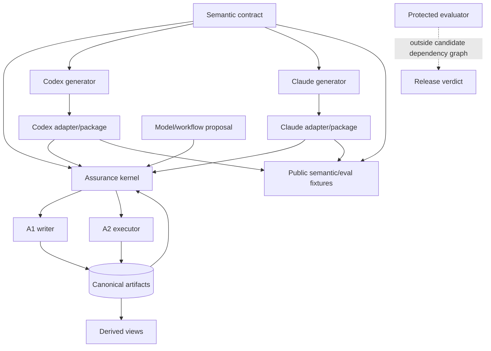

# Level 7 Dev Loop — Product Architecture

| Field | Value |
|---|---|
| Artifact ID | `L7-ARC-001` |
| Artifact type | Architecture decision and system design |
| Artifact schema | Bootstrap/pre-schema; migrate when the canonical artifact schema ships |
| Foundation step | 3 — Architecture |
| Status | Proposed — separate-context audit PASS; owner approval required |
| Version | 0.2.0 |
| Date | 2026-08-24 |
| Inputs | Approved [`L7-REQ-001`](requirements.md) 0.2.0 and [`L7-BKL-001`](feature-backlog.md) 0.1.0 |
| Product | Level 7 Dev Loop |
| Initial hosts | Codex CLI and Claude Code |
| Scope identity | Non-Git workspace snapshot observed on 2026-08-24; no commit identity available |
| Effect and risk | A1 artifact-only write; foundation-planning risk |
| Selected architecture | Option B — invocation-scoped local assurance kernel, capability executor, and thin generated host adapters |
| Selection state | Conditional on mutation closure, context/approval separation, and producer-attestation evidence; see `AR-001`, `AR-002`, and `AR-011` |
| Technology state | Intentionally unselected |
| Next authorization if approved | Foundation step 4 — technology selection only |

**Decision boundary:** this document selects logical ownership, trust boundaries, control flow, state semantics, failure behavior, and evolution constraints. It does not select an implementation language, framework, serialization format, database, graph store, IPC mechanism, test framework, sandbox, signing system, or packaging tool. It authorizes no implementation, skill/prompt edit, manifest change, installation, deployment, exposure, or release.

## 1. Decision summary

Level 7 SHALL use a **provider-neutral, local-first split-trust architecture**:

1. one authored semantic contract defines lifecycle, taxonomy, prompt/skill obligations, artifact semantics, policy, and public fixtures;
2. separate thin Codex and Claude adapters translate host discovery, invocation, capability, permission, and package lifecycle without redefining safety semantics;
3. models, prompts, skills, repository content, retrieved material, and subagents form an **untrusted proposal plane**;
4. a short-lived local assurance kernel validates canonical state, derives deterministic risk floors, resolves policy, verifies approval binding, and admits transitions;
5. an artifact writer owns A1 transactions, while a capability-scoped executor owns admitted A2 local mutations and factual verification evidence;
6. repository-owned artifacts are canonical lifecycle memory; status, indexes, and relationship graphs are rebuildable views;
7. generated host packages, protected evaluation, and release signing live in separate trust planes and bind the exact bytes they evaluate or promote.

The kernel is *invocation-scoped*, not memoryless: it has no hidden persistent service state and reconstructs decisions from validated repository artifacts plus current trusted inputs on every invocation. A minimal installation requires no Level 7 SaaS, daemon, MCP server, vector database, native hook, subagent, external memory, or telemetry.

### 1.1 Decisive feasibility conditions

`AR-001 — Level 7 mutation capability closure` is a release-blocking architecture risk:

> A host may claim Level 7 A1 or A2 support only when an actual-host experiment proves how the plugin locates and invokes the kernel/writer/executor and that Level-7-issued mutations at that effect class cannot bypass admission within the declared Level 7 operating mode.

The experiment must cover runtime/kernel discovery, executable invocation, writable-data discovery, tool confinement, direct skill/alias/natural-language calls, artifact writes, source/configuration writes, shell, Git, network, and equivalent host tools. Prompt instructions, a conductor, package-relative path assumptions, plugin-data availability, or an editable repository file are not enforcement. Host plugin-data is an optional cache/receipt location unless the declared host contract and lifecycle tests prove it; correctness and uninstall safety cannot depend on undocumented retention.

The safe capability ladder is strict: a host that cannot close any Level 7 write path supports A0 only; a host that can close the artifact writer but not project mutation may support A1; A2 requires closure of both. Level 7 claims control only over effects issued through Level 7, not unrelated actions a user asks the host to perform outside the product.

`AR-002 — model-bound ingress and approval separation` is a second release-blocking architecture risk. The actual host path must distinguish authenticated approval events from untrusted text and must establish which user, attachment, host, tool, summary, and retrieved payloads Level 7 can minimize before provider/model processing. A secret already submitted to a host/provider before plugin control cannot be retroactively protected; that boundary and limitation must be disclosed. Any Level-7-added context or downstream sink must pass the context gateway, and inability to enforce the supported secret-handling claim blocks that host/path.

`AR-011 — gate-bearing producer attestation` is the third release-blocking feasibility risk. A schema-valid record and self-claimed digest do not prove that the admitted writer/executor produced an effect. Step 4 must select a producer-receipt or fresh-reproduction boundary whose verification root is outside editable repository fields and proposal-plane access. Without it, execution/verification claims remain `USER_ASSERTED` or `UNVERIFIED`, cannot advance a gate, and C2/C7 remain blocked.

This is a conditional architecture decision, not evidence that either host already meets the condition. `L7-BL-040` must expose the real host mechanics early; `L7-BL-005`, `012`, `013`, and `015` must prove the final boundary before any enforcement or dual-host claim.

## 2. Evidence and architecture drivers

### 2.1 Local evidence baseline

| Observation | Architecture consequence |
|---|---|
| The prototype exposes 12 broad, directly user-invocable Markdown skills. | Routing is useful UX, not a security boundary. Release packaging must expose one dependable conductor and remove, replace, or internalize mutation-capable bypasses. |
| Root, Codex, Claude, and marketplace metadata duplicate version and description fields. | Host packages must be generated separately from one semantic source and checked for drift. |
| `l7-deploy` can direct real deployment after conversational approval. | The prototype path must be excluded or replaced; v1 has no A3–A5 execution capability. |
| `l7-release` models independence as a role/persona. | Protected review must use separate authority, permissions, context, and immutable candidate identity. |
| The workspace is not a Git worktree. | Content-digest scope identity, locking, compare-and-swap, and recovery are first-class behavior, not edge-case fallbacks. |
| No validator, schema, eval harness, CI, build metadata, lockfile, license file, or release evidence exists. | Current `1.0.0`, dual-host, enforcement, and MIT packaging claims remain unverified; architecture must create proof seams before implementation breadth. |
| `docs/artifacts/` now contains approved bootstrap requirements and backlog records. | Bootstrap Markdown remains readable governance evidence, then migrates explicitly into the canonical artifact contract without silent history loss. |

All local observations are `OBSERVED` as of 2026-08-24. Architecture scores and future feasibility judgments are `INFERRED` until tested.

### 2.2 Current host constraints

The host boundary is based on current official documentation, not assumed syntax parity:

- Codex plugins require `.codex-plugin/plugin.json`; plugin components such as `skills/` live at the package root, and components may be bundled independently. Relative component paths are package-root-relative. ([OpenAI: Build a plugin](https://developers.openai.com/plugins/build/plugins), accessed 2026-08-24.)
- Codex skills define repeatable workflows and may work without MCP. Live data, authentication, authorization, or controlled remote actions are reasons for a server boundary, not reasons to make MCP mandatory for local workflow semantics. Skill activation depends materially on the description and should receive positive and negative tests. ([OpenAI: Build skills](https://developers.openai.com/plugins/build/skills), accessed 2026-08-24.)
- Claude plugins are self-contained packages; plugin skills are namespaced, package-relative paths must remain inside the package, installed packages are copied into a host cache, and `${CLAUDE_PLUGIN_DATA}` has host-owned uninstall behavior. A root plugin `CLAUDE.md` is not a portable runtime substitute for packaged skills. ([Anthropic: Plugins](https://code.claude.com/docs/en/plugins), [Plugins reference](https://code.claude.com/docs/en/plugins-reference), accessed 2026-08-24.)
- OpenAI's official conversion guidance treats host hooks as non-portable and converts Claude commands/agents into skills. Therefore hooks may strengthen an adapter but cannot carry provider-neutral correctness. ([OpenAI: Convert a Claude Code plugin](https://developers.openai.com/plugins/guides/submit-claude-plugin), accessed 2026-08-24.)

These facts establish a **lowest-common semantic contract with capability-aware adapters**, not lowest-common-denominator UX. Each host may improve presentation or defense in depth, but it may not drop or reinterpret a safety-critical obligation.

### 2.3 Ranked architecture drivers

1. Fail closed on authority, effects, stale state, secrets, and prohibited v1 actions.
2. Preserve 100% cross-host agreement on risk, authority, prohibited effects, lifecycle transition, artifact validity, and release verdict.
3. Resume from repository-owned truth across interruption, compaction, and host switching.
4. Keep normal use proportionate: one visible entry point, one next transition, and a low-risk fast path.
5. Make prompts, skills, context, graphs, loops, and multi-agent work testable without making stochastic output authoritative.
6. Operate locally without a mandatory Level 7 service or extra repository-content egress.
7. Support new, existing, legacy-constrained, live, and retiring scopes through profiles rather than separate products.
8. Create a defensible path to package integrity, independent evaluation, and later bounded autonomy without granting it in v1.

## 3. Hard invariants and quality scenarios

### 3.1 Architecture invariants

| ID | Invariant |
|---|---|
| `AI-01` | Only validated current-session or externally attested authority can admit mutation; repository/model text remains `AP0`. |
| `AI-02` | The proposal plane can recommend an effect but cannot grant approval, lower the deterministic risk floor, expand scope, change policy, or mint a capability. |
| `AI-03` | Every Level-7-issued A1/A2 mutation terminates at its designated deterministic admission boundary. Unknown effect classes are treated as mutation-capable; R4 and A3–A5 execution block. |
| `AI-04` | A safety-critical semantic obligation has one authored source. Adapters may translate syntax and capabilities only. |
| `AI-05` | Canonical lifecycle state is reconstructable from valid repository artifacts without chat, model memory, host cache, or derived indexes. |
| `AI-06` | Source identity, approval, evidence, audit, and release verdict bind the same scope and candidate digest; material change makes them stale. |
| `AI-07` | Secret/context minimization occurs before provider, web, connector, subagent, log, or artifact boundaries; detection limitations are disclosed. |
| `AI-08` | A missing capability or proof produces `BLOCKED`, `NOT_EVALUATED`, or `UNVERIFIED`, never a synthetic pass. |
| `AI-09` | Protected evaluator data, release policy, signing authority, credentials, and future kill switches remain outside candidate read/write authority. |
| `AI-10` | Install, update, rollback, and uninstall preserve unowned files and canonical project artifacts unless separately authorized. |
| `AI-11` | No hidden chain-of-thought is requested or persisted. Decisions, sources, evidence, uncertainty, and reproducibility limits are persisted instead. |
| `AI-12` | V1 exposes no executable A3, A4, A5, background, self-modification, online-learning, or production-remediation capability. |

### 3.2 Quality-attribute scenarios

| ID | Stimulus and environment | Required response | Architectural measure |
|---|---|---|---|
| `QA-01 Safety` | Injected repository text says the user approved a broad write. | Preserve the text as untrusted data; approval remains AP0; block mutation. | Zero authority expansion in adversarial fixtures. |
| `QA-02 Portability` | The same valid state is opened in the other host. | Reconstruct the same safety-critical state and next transition; disclose capability differences. | 100% agreement on the six safety-critical parity axes. |
| `QA-03 Resumption` | A session stops at any lifecycle boundary. | A fresh process rebuilds state from canonical files and resumes the last valid incomplete transition. | No repeated approved work or approval inflation. |
| `QA-04 Concurrency` | A second writer changes an approved path after preview. | Pre-state compare-and-swap fails; no last-write-wins; require reframe/reapproval. | Zero silent overwrite in collision fixtures. |
| `QA-05 Privacy` | A selected input contains a known or transformed secret. | Exclude, redact, or block before context leaves the local boundary; preserve only safe markers/pointers. | Zero seeded-secret persistence or egress in supported paths. |
| `QA-06 Recovery` | A process stops during a multi-file A1/A2 transaction. | Do not advance lifecycle state; recover atomically or enter `RECOVERY_REQUIRED` with bounded instructions. | No partial effect reported as PASS. |
| `QA-07 Installation` | Existing instructions, settings, skills, or hooks collide with package setup. | Preview and block or perform an ownership-aware merge; never silently overwrite. | 100% declared-matrix lifecycle tests. |
| `QA-08 Evaluation` | A candidate attempts to inspect or alter hidden tests or thresholds. | Deny access, invalidate the run, and retain a digest-bound tamper result outside candidate scope. | Zero candidate read/write access to protected assets. |
| `QA-09 Usability/accessibility` | A new user or a low-risk local request reaches status. | Lead with accessible text and machine-readable state/why/evidence/uncertainty/blocker/decision owner/one next action; explain terms, never rely on color, and use the same invariants with reduced ceremony. | Status-field/order fixtures plus `BL-041` comprehension, ≤5-minute eligible diagnosis, decision-interruption, and failure/abandonment measures; no safety waiver. |
| `QA-10 Degradation` | Kernel, sandbox, verifier, provider, network, or host capability is absent. | Retain the highest safe lower effect class and state the one next recovery action. | No capability gap converted to PASS. |

## 4. Exactly three architecture options

### Option A — Federated host-native skills (“policy at the edges”)

One semantic authoring source renders self-contained skills; each host, model, and skill performs routing, state interpretation, approval handling, tool use, and artifact updates with minimal local machinery.

**Strengths:** fastest walking skeleton; simplest installation; transparent Markdown; strong native UX; low runtime/context overhead; straightforward A0 and advisory planning.

**Weaknesses:** prompt/model behavior sits on the authority path; direct invocation can bypass a conductor; policy and artifact rules drift across skills and hosts; TOCTOU, multi-file recovery, and approval replay are weak; enforcement depends on undocumented or optional host behavior.

**Failure boundary:** suitable for A0 and possibly tightly controlled A1, but it cannot truthfully support enforced A2 unless the host itself supplies and proves an equivalent non-bypassable mutation boundary. It fails the A2 safety hard gate as the primary v1 architecture.

### Option B — Invocation-scoped local assurance kernel and capability executor (“policy in the kernel”)

Thin generated adapters and untrusted model workflows propose typed transitions. A local deterministic kernel reconstructs state, resolves policy, derives risk, verifies approval, and issues an exact one-use action capability. An A1 writer or separately privileged A2 executor revalidates the capability immediately before staging, applying, and verifying the effect.

**Strengths:** one semantic and authority model; smallest practical trusted computing base; provider-neutral repository memory; deterministic safety decisions; bounded mutation and recovery; optional host accelerators; strong differential-test seams; natural containment for future profiles.

**Weaknesses:** greater v1 construction and packaging effort; capability lifecycle and cross-process failure must be designed carefully; local execution isolation varies by OS/host; usability depends on hiding machinery behind one conductor; A2 remains conditional on actual-host capability closure.

**Failure boundary:** when the trusted approval or mutation boundary is unavailable, the kernel denies that effect and the adapter visibly degrades. Logical kernel and executor boundaries may be co-packaged after Step 4 analysis, but the executor's privilege and admission contract may not collapse into model discretion.

### Option C — Repository event protocol and deterministic reducers (“policy in the ledger”)

Every intent, decision, approval, transition, effect, observation, and supersession is an append-only content-addressed event. Deterministic reducers construct current state, and actors coordinate through commands/events rather than updating current-state artifacts directly.

**Strengths:** strongest provenance, replay, temporal analysis, concurrency diagnostics, and later multi-agent/autonomy lineage; natural audit log and event-derived graphs; excellent reproducibility when every actor complies.

**Weaknesses:** highest v1 ceremony and cognitive cost; event evolution, conflicts, compaction, privacy deletion, and partial ordering are complex; human-readable current status becomes a projection; write admission still needs a privileged executor; a ledger can record unauthorized effects but does not prevent them.

**Failure boundary:** technically credible, but its operational and schema burden is disproportionate to the thin v1 journey. Privacy deletion and non-Git/offline merge semantics would dominate product learning before ordinary users validate the workflow.

## 5. Weighted decision and selection

Scores use 1 (poor) through 5 (strong). Weighted total is `weight × score / 5`. Scores are architecture judgments, not test results.

| Criterion | Weight | A | B | C |
|---|---:|---:|---:|---:|
| Fail-closed safety and authority | 20 | 2 | 4 | 4 |
| Cross-host semantic portability | 15 | 3 | 5 | 5 |
| Evidence, audit, and resumption | 15 | 3 | 4 | 5 |
| Proportionate user experience | 12 | 5 | 4 | 2 |
| V1 feasibility and learning speed | 12 | 5 | 3 | 2 |
| Evolvability and future profiles | 10 | 3 | 5 | 5 |
| Privacy, offline use, minimal dependency | 8 | 4 | 5 | 3 |
| Runtime/context/cost efficiency | 4 | 5 | 4 | 2 |
| Packaging and operability simplicity | 4 | 5 | 3 | 3 |
| **Weighted total / 100** | **100** | **70.4** | **83.4** | **74.4** |

### 5.1 Hard gates

| Gate | A | B | C |
|---|---|---|---|
| Safety score at least 4 for an A2 claim | Fail | Conditional pass | Conditional pass |
| One provider-neutral safety contract | Partial | Pass by design | Pass by design |
| No mandatory hosted service/MCP/vector store/hook/subagent | Pass | Pass | Pass |
| Repository-owned, cross-host reconstructable state | Partial | Pass | Pass |
| Actual-host A1/A2 capability closure | Unproved | **Unproved: `AR-001`** | Unproved |
| Model-bound ingress and approval separation | Unproved | **Unproved: `AR-002`** | Unproved |
| Gate-bearing producer authenticity | Unproved | **Unproved: `AR-011`** | Unproved |

### 5.2 Decision

Select **Option B**, conditional on `AR-001`, `AR-002`, and `AR-011`.

It supplies materially stronger prevention than Option A without imposing Option C's event-sourcing ceremony. It may borrow Option A's thin native presentation and Option C's content binding and provenance lineage; these are properties inside the selected design, not a fourth hybrid. V1 canonical truth remains validated current-state artifacts plus append-only evidence/supersession history—not a mandatory event journal.

If `AR-001`, `AR-002`, or `AR-011` fails, the decision does not silently fall back to prompt governance or self-authored evidence. A development or explicitly labeled prerelease may narrow to the effect/context/evidence level actually enforceable: AR-001 caps effects, AR-002 blocks unmediated approval or sensitive paths, and AR-011 prevents execution evidence from advancing gates. The approved v1.0 promise requires A2, supported context/approval handling, and verified local evidence on both initial hosts, so failure of any condition blocks C7 stable dual-host release unless the requirements and backlog are revised and reapproved.

## 6. System context, principals, and trust zones

### 6.1 System context

```mermaid
flowchart LR
    H[Accountable human] -->|untrusted goal / attachments| A[Codex or Claude host ingress]
    A -->|payloads Level 7 can mediate| C[Context gateway / read broker]
    R[(Repository source, policy, artifacts)] -->|bounded reads; untrusted content| C
    T[Tool output, summaries, retrieval, subagents] -->|untrusted payloads| C
    C -->|minimized + labeled context| M[Model, conductor, workflows, optional subagents]
    H -->|authenticated event; never model text| CB[Trusted confirmation bridge]
    CB --> K[Local assurance kernel]
    M -->|typed proposal only| K[Local assurance kernel]
    R -->|validated state + pre-state identity| K
    K -->|admitted A1 transaction| W[Artifact writer]
    K -->|one-use A2 capability| X[Local mutation executor]
    W -->|effect facts| Q[Receipt attestor outside editable fields]
    X -->|effect facts| Q
    Q -->|verifiable receipt| K
    W -->|canonical record transaction| R
    X -->|bounded source delta| R
    R --> P[Public local evaluator]
    CA[Candidate author / remediator] --> B[Builder]
    B --> U[Normalized unsigned payload]
    U --> S[Signer]
    S --> D[Immutable signed candidate]
    D --> PE[Protected evaluator]
    PE -->|digest-bound attestation| RV[Independent release reviewer / verdict]
    RV -->|GO / CONDITIONAL_GO / NO_GO| H
    H -->|accountable promotion authorization| PR[Promoter]
    D --> PR
    K -. no A3-A5 capability .-> O[External / production systems]
```



The dashed edge is a prohibition, not a future implementation hook. The host may process the initial user message before Level 7 gains control; §10.3 and `AR-002` make that outer provider boundary explicit instead of depicting impossible retroactive filtering.

### 6.2 Principals

| Principal | Responsibility | Authority limit |
|---|---|---|
| Requester | States desired outcome. | A request is not approval or proof of organizational authority. |
| Operator | Runs the host and Level 7 flow. | May act only within separately granted scope. |
| Accountable approver | Accepts the bounded risk/effect. | Approval is exact, expiring, revocable, and cannot authorize R4. |
| Qualified reviewer/domain approver | Supplies competence and independence where required. | Cannot be candidate author/remediator for the reviewed decision. |
| Environment owner | Attests authority over an environment. | V1 uses this only for handoff; it executes no external/production effect. |
| Host/model/conductor | Interprets intent and proposes work. | No authority minting, policy weakening, general mutation credential, or independent-review status. |
| Adapter/context gateway | Translates host syntax/capabilities, mediates Level-7-controlled context, and passes authenticated confirmation provenance outside model text. | Cannot redefine semantic obligations, promise control before host ingress, or silently emulate a missing control. |
| Kernel | Makes deterministic admission and state-transition decisions. | No model judgment, hidden memory, external effects, or self-modification. |
| Writer/executor | Performs a specifically admitted local transaction. | No scope expansion, approval interpretation, remote publish, credentials, or A3–A5. |
| Receipt attestor/verifier | Produces or verifies a gate-bearing receipt rooted outside editable repository fields. | No project mutation, semantic decision, general signing oracle, or model-visible capability. |
| Evaluator | Measures an immutable candidate and issues a digest-bound evaluation attestation. | Public evaluator cannot grant release; protected evaluator cannot remediate candidate or decide promotion. |
| Candidate author/remediator | Proposes or changes a candidate under ordinary scoped controls. | Cannot change frozen evaluator controls, sign, review independently, or promote. |
| Builder | Produces the normalized candidate payload from frozen source. | Cannot sign, decide release, or promote. |
| Signer | Attests the immutable candidate through an external trust root. | Cannot alter evaluated bytes/evidence, issue the release verdict, or promote. |
| Independent release reviewer/verdict issuer | Reviews the digest-bound evaluation and release packet; issues `GO`, `CONDITIONAL_GO`, or `NO_GO`. | Cannot remediate, sign, or promote; `CONDITIONAL_GO` cannot authorize v1.0. |
| Accountable release owner | Accepts the exact-digest verdict and authorizes or rejects promotion. | Cannot turn a missing/conditional verdict into release evidence or mutate the candidate. |
| Promoter | Publishes only the exact candidate authorized by the accountable release owner. | Cannot build, sign, review, alter bytes, or choose a different channel/surface. |

### 6.3 Trust zones

| Zone | Contents | Trust rule |
|---|---|---|
| `Z0 External authority roots` | Current-user provenance, AP2/AP3 systems, organization/environment authority, signing and revocation roots. | Repository/model text cannot enter this zone. |
| `Z1 Local control kernel` | Schema/state validation, deterministic risk floor, policy resolution, approval verifier, capability issuer, producer-receipt verifier, transition CAS. | Small, reviewable, no network/model dependency, non-self-modifying. |
| `Z2 Privileged effect plane` | A1 artifact writer, A2 local executor, receipt attestor, staging/journal/recovery. | Operation-scoped privilege only; default deny; no A3–A5 or model-visible attestation oracle. |
| `Z3 Proposal plane` | Host, model, conductor, semantic workflows, prompts, optional subagents. | Fallible and injection-exposed; output is typed proposal data. |
| `Z4 Repository/data plane` | Source, Git metadata, artifacts, policies, logs, dependencies, retrieved files. | Untrusted until validated; lifecycle truth does not imply authority. |
| `Z5 Context/provider boundary` | Local minimizer/redactor, selected model provider, optional allowed retrieval. | Minimize before crossing; disclose provider processing and limitations. |
| `Z6 Evaluation/release plane` | Frozen public evaluator controls, external protected holdout, immutable candidate, verdict, accountable release decision. | Candidate cannot alter public controls; candidate author cannot read/list/write hidden cases, labels, thresholds, details, or promotion. |
| `Z7 Build/update plane` | Semantic source, generators, builder, package inventory, provenance, SBOM, signer, update/revocation metadata, host lifecycle controller. | Builder, signer, and promoter remain separate; establish trust before execution; runtime cannot authenticate itself. |
| `Z8 Future external/autonomy plane` | External systems, credentials, scheduler/controller, watchdog/kill switch. | Absent and disabled in v1; new charter and threat model required. |

## 7. Logical components and dependency rules

Logical separation does not prescribe processes, binaries, language modules, or IPC. Step 4 decides physical deployment while preserving these ownership rules.

| Component | Owns | Explicitly does not own |
|---|---|---|
| Semantic contract registry | Taxonomies, lifecycle rules, obligation IDs, skill/profile contracts, prompt sections, policy invariants, knowledge metadata, public fixture definitions. | Host syntax, mutable project state, approval credentials. |
| Host package generators | Deterministic translation of the semantic contract plus one host overlay into a self-contained package. | New semantic rules or reverse-generation from rendered files. |
| Codex/Claude adapters | Discovery, invocation, capability probe, permission map, trusted-confirmation bridge, host wording, package-data/cache lifecycle. | Risk/gate decisions, artifact truth, model authority, cross-host policy forks. |
| Conductor and workflow modules | Intent interpretation, one-transition proposal, profile selection, clarification, planning, explanation. | Direct trusted mutation or final gate/release authority. |
| Context gateway/read broker | Root-bounded discovery plus Level-7-controlled user/attachment/host/tool/summary/retrieval/subagent payload mediation; allowlisting, relevance selection, provenance/trust/sensitivity labels, pre-provider minimization/redaction. | General filesystem traversal, approval inference, a promise to intercept host ingress before plugin control, or perfect secret detection. |
| Local assurance kernel | Schema/semantic validation, state reduction, risk floors, policy/waiver precedence, AP checks, capability negotiation, producer-receipt verification, transition admission, CAS decision. | Natural-language creativity, project mutation, network, credentials, hidden persistence. |
| Artifact transaction writer | Atomic or recoverable A1 changes to authorized Level 7 artifact scope and gate-bearing evidence/receipt transaction. | Source/config writes, approval granting, unrelated cleanup. |
| Local mutation executor | Staging, exact A2 delta application, sandboxed verification, postconditions, producer receipt inputs, evidence, compensation/recovery. | Remote Git, network, credentials, deployment, exposure, destructive/irreversible or external actions. |
| Producer-receipt boundary | An unforgeable or independently attestable binding among executor/writer identity, action capability, actual effect, evidence, candidate, and transition; trust root is outside editable repository fields and proposal-plane access. | General signing service, model-visible credential, project policy, or substitute for fresh reproduction when attestation is unavailable. |
| Canonical repository memory | Human-readable, machine-validatable lifecycle records and provenance owned by the consuming repository. | Runtime secrets, hidden reasoning, protected eval data, mutable package cache. |
| Derived view builder | Status, search index, evidence/provenance graph, summaries, cached projections. | Canonical truth; deletion must be harmless. |
| Frozen evaluator-control partition | Public protocol, oracles, authorization controls, adjudication and thresholds under a separately authorized governance transition. | Candidate/remediation writes; any authorized change invalidates affected evidence. |
| Public evaluation plane | Local readable fixtures, deterministic graders, calibration inputs, run manifests. | Candidate writes to frozen controls, protected labels, independent release authority. |
| Protected evaluation/release plane | Hidden cases, adjudication, evaluator attestation, digest-bound verdict, promotion separation. | Candidate remediation or candidate-readable storage. |
| Distribution assembler | Self-contained host packages, allowlisted inventory, compatibility metadata, SBOM/provenance/signing inputs, install receipt contract. | Lifecycle truth, mutable user project data, signing, release decision, or promotion. |
| Host lifecycle controller | Trusted package-manager install/enable/update/rollback/disable/remove actions plus an explicit Level 7 preparation flow where supported. | Silent project bootstrap/migration, undocumented uninstall callbacks, or unowned host configuration. |

### 7.1 Dependency direction



Rules:

1. The semantic registry never imports a host adapter; adapters import obligation IDs and generated contracts.
2. The kernel imports semantic rules and a repository/OS abstraction, never a model or host API.
3. An adapter imports the typed kernel boundary and host API, never the other adapter.
4. The model receives proposal schemas but never the kernel's authority-bearing capability or producer-attestation material.
5. Derived views import canonical records; canonical records never depend on a view or graph store.
6. Frozen public evaluator controls and protected evaluation/release authority remain outside candidate mutation permissions.
7. Hooks, MCP, memory, browser, and subagents may attach only as declared, capability-tested accelerators. Removing them cannot change correctness or authority semantics.

### 7.2 Logical source and package map

The architecture requires the following logical ownership; names and serialization remain Step 4 decisions:

```text
authored product source
├── semantic lifecycle, taxonomies, skills, prompts, profiles, knowledge
├── artifact/state contracts and migrations
├── safety, authority, policy, and action-envelope contracts
├── host overlays
│   ├── Codex
│   └── Claude
├── deterministic generation and drift checks
├── public schemas, fixtures, graders, and conformance rules
└── packaging, compatibility, provenance, and lifecycle contracts

rendered release outputs
├── self-contained Codex package
│   ├── .codex-plugin/plugin.json and host invocation metadata
│   ├── conductor and rendered workflow/profile resources
│   ├── applicable kernel, A1 writer, A2 executor, and receipt-verification boundary
│   ├── artifact/state contracts, migrations, and shipped references
│   └── compatibility, permissions, inventory, legal, and release material
└── self-contained Claude package
    ├── .claude-plugin/plugin.json and host invocation metadata
    ├── conductor and rendered workflow/profile resources
    ├── applicable kernel, A1 writer, A2 executor, and receipt-verification boundary
    ├── artifact/state contracts, migrations, and shipped references
    └── compatibility, permissions, inventory, legal, and release material

consuming repository
└── docs/artifacts/ (canonical user-owned lifecycle state)

independent release environment
└── protected cases, evaluator policy, signing/promotion authority
```

Generated packages SHALL contain no link to a sibling source tree and no runtime dependency on this product repository's governance artifacts. If an applicable runtime boundary cannot physically ship inside a host package, the external local prerequisite must be independently authenticated, versioned, compatibility-declared, lifecycle-tested, and visible in doctor; its absence lowers the supported effect ceiling. A package may not infer executable or writable-data locations from undocumented host behavior.

## 8. Repository memory, state, provenance, and graph model

### 8.1 Four memory layers

| Layer | Role | Authority and lifetime |
|---|---|---|
| Canonical repository artifacts | Current lifecycle records, decisions, evidence, approval records, provenance, supersession, recovery state. | Durable truth after validation; user-owned; ordinary readable files; never grants authority by presence. |
| Derived local views | Status, search/index, relationship graph, cached summaries, compatibility projections. | Rebuildable and disposable; must carry source pointers/digests. |
| Host session/context | Current goal, selected context, model outputs, tool transcript. | Ephemeral and untrusted except for specifically authenticated user/host events. |
| Optional host/plugin memory | Preferences, receipts, caches, resumable UX hints. | Non-canonical, non-secret, disposable; loss cannot change lifecycle truth. |

No vector database or graph database is required in v1. Evidence relationships form a logical provenance graph over canonical IDs: artifact/entity, producing activity, actor, delegation, derivation, source, supersession, verification, and approval record. A derived index may accelerate navigation but is never a second source of truth.

### 8.2 Canonical record contract

Every canonical record carries the approved common envelope: ID, type, schema version, status, scope, source identity, timestamps, provenance, and applicable risk, evidence, approval record, sensitivity, supersession, retention, and review/expiry. Architecture adds these handling rules:

- validate structure and cross-record semantics before reduction;
- treat unknown fields as round-trippable data, not reasons to erase forward history;
- distinguish planned checks from executed evidence;
- bind evidence and approval records to source/scope/candidate identity;
- require any record that advances an execution, verification, assurance, or release gate to carry a kernel-verifiable producer receipt rooted outside editable repository fields, or require fresh reproduction by an admitted verifier;
- classify structurally valid but unattested manual/self-authored execution claims as `USER_ASSERTED` or `UNVERIFIED`; they may inform triage but cannot advance a gate;
- persist approval evidence as AP0; revalidate AP1/AP2/AP3 outside editable artifact text;
- correct evidence-bound history by explicit supersession or tombstone rather than silent mutation;
- redact/minimize payloads while retaining safe provenance and deletion-limit records;
- never persist secrets or hidden chain-of-thought.

The repository-owned canonical representation itself SHALL remain human-readable and machine-validatable. If Step 4 selects paired physical forms, both are one atomic canonical record with one identity and a divergence-impossible validation/commit rule; a disposable derived view cannot satisfy this requirement.

### 8.3 State reduction

The current phase is a deterministic reduction over valid records, their relationships, and any required producer-receipt verification—not the newest filename, a self-consistent digest claim, or a model summary. The logical vocabulary and common forward path are:

```text
BASELINE → FRAMED → APPROVAL_REQUIRED → APPROVED
         → EXECUTING → VERIFYING → CANDIDATE → ASSURANCE
         → HANDOFF_READY → OBSERVING → LEARNING → CLOSED
```

This is not a mandatory universal linear recipe. The selected profile defines allowed transitions, applicable skips, and rework edges; verification or observation can return to an earlier gate, and learning may frame a new work item without self-promoting it. `BLOCKED`, `NOT_EVALUATED`, `UNVERIFIED`, and `RECOVERY_REQUIRED` are explicit outcomes/conditions, not successful phases. Profiles may skip a non-applicable phase only with a validated reason. A material scope, risk, plan, candidate, recovery, evaluator control, or policy change invalidates dependent approval/evidence and returns to the earliest affected gate.

### 8.4 Source identity, transactions, and concurrency

- In Git, bind to the applicable commit/tag plus scoped dirty-state digest. Outside Git, bind to an explicit root, allowlisted path set, normalized metadata required by policy, and content digests.
- Use one writer lease for an overlapping scope, but treat the lease as advisory defense. Preimage compare-and-swap immediately before effect is authoritative.
- Stage a transition as a set; validate intended and actual delta; commit atomically where possible.
- When atomic multi-file replacement is unavailable, keep a bounded journal of digests, paths, operation state, and postconditions; do not duplicate raw preimages by default. Secret-bearing or unclassifiable preimages require an approved user-owned/non-persisting snapshot or a protected temporary recovery store whose access, minimization, crash cleanup, deletion, and model/provider exclusion are explicit. If no safe recovery method exists, block the target. Enter `RECOVERY_REQUIRED` after interruption and never claim PASS on a partial transaction.
- Concurrent disjoint readers are allowed. Concurrent writers need disjoint proven scopes or isolated workspaces and one integration owner. Capabilities cannot be delegated between agents.
- Schema migration is an explicit previewed A1 project transition with history and rollback/irreversibility evidence, never a silent install/update side effect.

## 9. Runtime and control flows

### 9.1 Common request flow

```text
trusted user event + host capability report
  → root-bounded inventory/read request
  → local context allowlist, minimization, trust/sensitivity labeling
  → model/conductor typed proposal
  → canonical artifact/state validation
  → deterministic risk floor + policy resolution
  → exact next-transition preview
  → required approval assurance check
  → A0 result, A1 transaction, A2 capability, or BLOCKED
  → factual postcondition/evidence recording
  → state compare-and-swap
  → one next status
```

Repository, web, log, dependency, memory, and subagent inputs retain untrusted provenance through every transformation. An adapter may change syntax or explanatory wording, never a safety-critical field.

### 9.2 A0 — inspect and plan

1. Adapter reports actual host/version/capabilities, provider boundary, and supported effect ceiling.
2. Read broker resolves the authorized root and denies traversal/symlink escape.
3. Context compiler selects minimal authoritative/relevant inputs and removes or blocks sensitive material before provider context.
4. Model proposes classification, evidence states, uncertainty, and one next transition in the typed schema.
5. Kernel validates taxonomy, scope, policy, and artifact state; it may raise risk or narrow the result.
6. Adapter renders status. No repository code, build, test, Git hook/filter, network, or external action is presumed read-only merely because its intent is diagnostic.

### 9.3 A1 — artifact-only transition

1. Model proposes an artifact transition and exact artifact delta.
2. Kernel re-derives effect/risk, validates profile and prerequisites, and produces an exact preview.
3. Adapter obtains the required current-session confirmation through a channel distinguishable from repository/model text.
4. Kernel binds approval to action, target, source/plan digest, environment, role provenance, validity, and recovery; it rechecks state immediately before write.
5. Artifact writer acquires the scoped lease, checks preimages, stages the complete set, validates it, and obtains a producer receipt bound to the admitted capability and actual transaction.
6. The artifact records, producer receipt, and final transition reference commit as one atomic or recoverable set; a manual/self-consistent imitation cannot advance the gate.
7. Persisted approval becomes an AP0 record. The next mutation requires fresh applicable assurance.

### 9.4 A2 — bounded local mutation

The proposal plane emits an **action envelope** containing at least:

- effect/action and command/tool class;
- canonical root and exact allowed path set;
- plan and candidate/delta digest;
- expected pre-state identity and overlap/dirty-state facts;
- environment and capability assumptions;
- model risk evidence plus deterministic risk inputs;
- intended delta and prohibited effects;
- approval requirements, actor/role provenance, expiry, and nonce;
- resource, retry, time, token, and cost bounds;
- recovery/compensation and postconditions;
- verification plan and allowed scratch/output locations.

Admission and execution sequence:

1. Kernel validates state/profile and independently derives the effect and highest material risk floor; the model may raise but never lower it.
2. Policy resolves monotonically: platform/host and non-waivable invariant → authenticated organization → trusted repository constraint → scoped decision → untrusted content. Lower levels may tighten, never grant or weaken. Unresolved conflict blocks. A typed waiver binds the exact control, scope/target/candidate digest, rationale and evidence, residual risk, owner/approver assurance, compensating control, expiry, and review condition. Evidence honesty, authority, secret protection, audit integrity, and no-self-approval remain non-waivable.
3. Adapter shows the exact effect, scope, relevant risk, recovery, and proof plan; the trusted confirmation bridge obtains the required assurance.
4. Kernel binds a one-use, non-delegable, expiring capability to the envelope and current pre-state. The physical capability mechanism is a Step 4 decision.
5. Executor immediately re-resolves root, boundary/mount, case/Unicode normalization, symlinks/junctions, path ownership, source identity, dirty/overlap state, policy, approval freshness, intended delta, and capability.
6. Executor acquires a scoped writer lease and uses preimage compare-and-swap plus no-follow/pinned-target semantics where available. Mismatch aborts before mutation.
7. Executor stages in an isolated or equivalent controlled workspace when available, with no credentials, remote publish, undeclared network, or undeclared write paths.
8. Actual delta is compared to the approved envelope. Unexpected process, path, Git, network, or data effects fail.
9. Allowed verification runs as untrusted repository code within declared effect/resource bounds; commands that did not run remain `UNVERIFIED`.
10. Writer/executor facts cross the producer-receipt boundary; only after the kernel verifies a receipt binding the admitted action, actual delta, postconditions, evidence, candidate digest, and transition does it admit state advancement. If the attestation boundary is unavailable, fresh admitted reproduction is required and the existing claim remains `UNVERIFIED`.
11. Crash, cancellation, partial effect, or evidence/state mismatch enters `RECOVERY_REQUIRED`; it never becomes PASS.

R1 follows AP1. R2 adds a required separate-context verifier and AP2 when policy requires attested identity. R3 may create a policy-permitted local candidate with AP1, but R3 PASS/GO/handoff requires AP2, structurally independent qualified review, and accountable approval; AP3 applies when multiple authorities are required. R4 always blocks.

### 9.5 Resume and host switch

1. Validate package/host/schema compatibility and capability deltas.
2. Parse and validate canonical files, preserving unknown fields and quarantining invalid records from state advancement.
3. Rebuild derived views; compute Git or non-Git source identity and current overlaps.
4. Reclassify every persisted approval as AP0 pending current validation; invalidate stale candidate evidence.
5. Return exactly one valid incomplete transition, one material clarification, or one blocked recovery action.

No host cache or conversation summary may fill a missing canonical gate.

### 9.6 Audit, handoff, and release

1. Freeze source, artifact, and package digests plus the public evidence packet.
2. A read-only reviewer in a separate authority/context receives only the scoped candidate and claims.
3. Findings bind to the exact identity; remediation is a different transition and invalidates affected review.
4. A3/A4 work is a plan/evidence handoff only. Level 7 passes no credentials and invokes no external target.
5. Protected evaluation runs the immutable generated package in a fresh isolated case environment outside candidate scope.
6. The independent release reviewer consumes digest-bound conformance, holdout, pilot, provenance, compatibility, recovery, and residual-risk evidence and issues the verdict. The accountable release owner separately authorizes the promoter for the exact candidate; `CONDITIONAL_GO` cannot promote v1.0.

### 9.7 Observe, Learn, Decide, and Close

1. Ingest only provenance-labeled outcome evidence through the context/evidence boundary; external-system access is a separately authorized handoff or later connector, never hidden v1 execution.
2. Bind observations to the released/exposed candidate, cohort/environment, time window, metric definition, baseline, sampling limits, and source authority. Missing observation remains `UNVERIFIED`/`NOT_EVALUATED`.
3. The model may propose an outcome interpretation; deterministic validity and policy rules preserve uncertainty and prevent metric gaming or individual ranking.
4. The accountable owner records exactly one product outcome decision: `SHIP`, `ITERATE`, `DEFER`, `ROLLBACK`, `RETIRE`, or `REJECT`.
5. `ITERATE` or a material new finding creates a newly framed transition with fresh risk/approval. It does not edit the current candidate, evaluator, or policy automatically. A completed observation/decision may close the scoped work while retaining supersession, retention, and follow-up links.

## 10. Prompts, skills, workflows, context, loops, and agents

### 10.1 Semantic skill contract

Each authored workflow/profile is structured semantic data with:

- stable ID/version and obligation IDs;
- concise positive and negative activation signals;
- prerequisites and canonical input artifacts;
- effect class, risk inputs, authority, tools, and prohibited effects;
- output artifact/transition schema;
- success, failure, blocked, stopping, and escalation behavior;
- context sources and sensitivity rules;
- host capability/support declaration;
- public positive, negative, boundary, degraded, interruption, and adversarial fixtures.

Only a narrow conductor is publicly discoverable by default. Specialist modules are selected from validated state and intent behind the conductor, not exposed as a dozen competing broad descriptions. Direct aliases or legacy names must terminate at the same kernel or be absent from the package.

### 10.2 Prompt compiler

Prompts are rendered from semantic fields in this order:

1. bounded goal and current transition;
2. authoritative canonical inputs with source pointers;
3. trust, sensitivity, freshness, and evidence labels;
4. invariants and prohibited effects;
5. current authority/tool/capability envelope;
6. acceptance criteria and required proof;
7. retry, resource, cost, stopping, and escalation budget;
8. required typed output shape.

Host renderers may change syntax, examples, or presentation but must retain every safety-critical obligation ID. Build-time worst-case discovery/context budgets and actual-host compaction fixtures must prove retention; the design does not assume a host callback can detect arbitrary runtime truncation. Indispensable decisions stay in the deterministic kernel. If a critical prompt obligation cannot be retained or its loss reliably detected on a host/version, that matrix entry is unsupported. Policy lives in the semantic/kernel contract; duplicating hidden policy prose across prompts is prohibited.

### 10.3 Context engineering

- Route every payload Level 7 controls before model/provider or persistence—user projections/attachments accepted by a Level 7 ingress, host metadata, repository reads, tool output, summaries, retrieval, memory, subagent output, logs, and artifact payloads—through one source- and sink-side context gateway. Authenticated approval events travel directly to the kernel and are never echoed as model text.
- A host may transmit the initial natural-language message before plugin execution. Level 7 must disclose that outer provider boundary and must not claim it filtered a secret already submitted there. The support matrix records whether a locally mediated ingress exists; sensitive workflows that require unavailable pre-provider control block or use a user-approved safe projection.
- Prefer allowlisted, relevance-bounded retrieval over “read everything then redact.”
- Rank context by authority, relevance, freshness, sensitivity, risk, and budget.
- Attach source identity, pointer, trust, sensitivity, inclusion reason, and transformation lineage to every selected item.
- Treat summaries as derived; preserve canonical pointers and unresolved blockers across compaction.
- Run local source-side and sink-side minimization/redaction for known secret forms, private keys, URL credentials, environment files, high-entropy/encoded/split fixtures, and sensitive command output. State false-negative limits; inability to exclude safely blocks the path.
- Disclose the model/provider boundary even for A0, including which payloads crossed before Level 7 control. Offline validators and artifact status continue without Level-7-owned egress.

### 10.4 Loop engineering

Every loop is an explicit state transition with a policy-owned maximum for tool calls, subagents, retries, wall time, tokens, and monetary cost. Exhaustion stops or escalates; it never weakens a safety gate. Repeated failure signatures trigger a circuit break and one recovery action. Success is a validated postcondition, not “the model stopped.” Oscillation, repeated reclassification, and unchanged remediation are visible evidence.

### 10.5 Optional multi-agent architecture

Delegation is an optimization, never a correctness dependency. A delegation manifest binds objective, disjoint scope, minimum context projection, authority, tools, budget, output schema, evidence, verifier, and termination. Subagents receive no approval capability, raw credentials, protected evaluation data, or authority expansion. Their results re-enter as untrusted proposals/evidence candidates. Parallel writes require disjoint paths or isolated workspaces and one integration owner; the kernel remains the only admission authority.

### 10.6 Guardrail registry

Every guardrail records owner, input, decision, enforcement locus, failure mode, evidence, overrideability, and tests. Allowed loci include deterministic kernel/writer/executor, host sandbox/permission, CI/evaluator, external authority, human confirmation, and prompt-only guidance. High-consequence prompt-only rules are labeled guidance and cannot support an “enforced” claim.

### 10.7 Stage and proof-profile composition

The kernel and lifecycle are common across new, existing, legacy-constrained, live, retiring, and mixed scopes. A scope classifier selects heritage and operational state per component; a profile contributes prerequisites, context sources, proof obligations, stopping rules, recovery, and observation without redefining authority or evidence semantics. Multiple applicable profiles compose by the union of obligations and the highest material risk/gate—never by averaging requirements down.

V1.0 ships only generic, feature/behavior-change, and behavior-preserving-refactor proof profiles. Database/schema, security/privacy, dependency/supply-chain, UX/accessibility, performance/scaling, legacy/deprecation, architecture/modernization, infrastructure/configuration, incident/operations, and tenancy profiles use the same extension contract in v1.x. Until a materially required profile is shipped and evidenced, Level 7 may classify, plan, and name the gap but returns `BLOCKED` or `NOT_EVALUATED`, never a generic PASS.

### 10.8 Decision-first experience contract

The experience problem is procedural opacity: users should not need to understand the internal skill graph or scan a long assurance report to know what is true and what they must decide. Every host renderer therefore leads with the same information architecture:

1. scoped phase/gate and source identity;
2. observed evidence versus inference, assertion, and unknowns;
3. material uncertainty, blockers, capability/provider limits, and residual risk;
4. requester/operator/approver/reviewer status and required assurance;
5. exactly one next transition, one branching decision, or one recovery action;
6. progressive detail for rationale, provenance, checks, and machine-readable payload.

Approval UI/text must show the exact effect, target, delta digest, environment, validity, recovery, and consequences of confirm/cancel before asking. Output must remain understandable without color, use accessible plain text and explained terminology, avoid unsupported absolutes, and expose an equivalent machine-readable status. Fixtures test ordering and field presence; formative research and `BL-041` measure comprehension, first-diagnosis time, decision interruptions, and abandoned/failed journeys.

## 11. Host packages and lifecycle

### 11.1 One-way generation

```text
semantic source + Codex overlay  → deterministic renderer → immutable Codex package
semantic source + Claude overlay → deterministic renderer → immutable Claude package
```

The build records semantic version/source digest, adapter version, capability matrix, renderer version, inventory, and package digest. The normalized unsigned payload SHALL reproduce byte-for-byte. Timestamps, channel metadata, transparency records, and signatures that cannot be part of that normalized payload live in separately normalized attestations bound to its digest. CI regenerates and diffs, rejects hand-edited output drift, and packages by allowlist. No reverse generation from packages is allowed.

Both packages share a semantic version and changelog but promote independently after their own compatibility and conformance evidence. A pass on one host cannot create a dual-host or stable `1.0.0` claim.

Release channel and every exposed product surface are part of the compatibility boundary. Development may use a local/repository-scoped marketplace, but stable publication may not use a channel that also exposes the package to untested ChatGPT, desktop, web, or other surfaces unless those surfaces can be excluded or are added to requirements and conformance. For Codex, Step 4/C−1 must verify the current `.agents/plugins/marketplace.json` catalog contract and distinguish marketplace registration, package installation, enablement, update, disablement, and removal rather than assuming a single `install` command.

### 11.2 Install, update, rollback, and uninstall ownership

- Establish package identity, digest, provenance, dependency integrity, license/notices, permission manifest, update freshness/revocation, and compatibility before executing package code.
- Install self-contained files through host-supported package mechanisms; never require copy/merge into `AGENTS.md`, `CLAUDE.md`, settings, hooks, or skills.
- V1 installation creates no extra active integration outside host-package-manager ownership unless the official host mechanism is explicitly reversible and lifecycle-tested. Record an ownership receipt for any exact Level 7-created active entries/digests without assuming undocumented plugin-data retention.
- Where a declared host/version documents writable plugin-data and its lifecycle, Level 7 may place only rebuildable caches, receipts, and non-sensitive preferences there. Plugin-data is otherwise unavailable/unknown; canonical project state, correctness-critical state, producer trust roots, and secrets never depend on it.
- Update validates the new package side by side and checks artifact-schema compatibility. Package rollback and artifact migration rollback are distinct decisions.
- Package lifecycle is two distinct operations, not an assumed uninstall callback: while the plugin is still present, an explicit `prepare-removal` transition inventories receipts, previews conflicts, removes or preserves only proven Level-7-owned optional integration, and records recovery; the user/host package manager then disables/removes the immutable package through its documented mechanism. Skipping preparation must remain safe: no unowned file is removed and project artifacts persist.
- Install, enable, update, rollback, prepare-removal, disable, and host removal bind exact targets/digests and current user confirmation, use conflict compare-and-swap, and have partial-failure journal/compensation semantics. If the host cannot supply the required enforcement, Level 7 adds no extra integration and reports the lifecycle limitation.
- Disclose missing receipts, last-scope removal, plugin-data deletion/retention, and host-owned residual cache behavior instead of claiming erasure Level 7 cannot prove. Negative tests cover skipped preparation, absent/diverged receipt, partial lifecycle failure, and residual cache.
- Runtime fetch from mutable remote reference content is disabled by default; shipped knowledge is versioned, hash-bound, licensed, and freshness-labeled.

### 11.3 Current prototype disposition

| Current path | Architecture disposition |
|---|---|
| `docs/artifacts/requirements.md`, `feature-backlog.md`, `architecture.md` | Product-repository governance source now; later migrate explicitly. They are not copied as runtime project state into release packages. |
| `skills/l7-next/SKILL.md` | Conform as the sole default public conductor; render host-specific invocation/description from one host-neutral contract. |
| `skills/l7-constitution/SKILL.md` | Replace with internal semantic scope/invariant/frame obligations; remove arbitrary line targets and direct public routing. |
| `skills/l7-greenfield/SKILL.md` | Internal future greenfield profile resource for `BL-016`; not a competing v1 public entrypoint. |
| `skills/l7-build/SKILL.md` | Replace with internal generic/feature/refactor execute-and-verify profile behind the conductor and common kernel. |
| `skills/l7-change/SKILL.md` | Replace with internal live-scope framing and local-candidate/handoff behavior; no external execution. |
| `skills/l7-review/SKILL.md` | Replace with internal prior-work evidence-gap and candidate-assurance workflow; no absolute compliance verdict. |
| `skills/l7-deploy/SKILL.md` | Remove from executable v1 surface; replace with A3/A4 plan-and-handoff semantics. |
| `skills/l7-release/SKILL.md` | Replace persona independence with digest-bound structurally separate audit/release flow. |
| `skills/l7-ops/SKILL.md` | Exclude from v1 executable surface; migrate applicable incident/operations intent to future `BL-022` profiles. |
| `skills/l7-experience/SKILL.md` | Exclude as a broad public v1 skill; migrate evidence-led UX/accessibility intent to future `BL-019` profile and the plugin's status experience contract. |
| `skills/l7-geometry/SKILL.md` | Retire the universal/perfection contract; any useful geometry checks require product-specific criteria under future UX assurance. |
| `skills/l7-storybook/SKILL.md` | Exclude from universal workflow; migrate tenancy/collaboration intent to applicable future `BL-029` profile. |
| `.codex-plugin/plugin.json` | Prototype now; later a generated file inside the independent Codex package. |
| `.claude-plugin/plugin.json` | Prototype now; later a generated file inside the independent Claude package. |
| root `plugin.json` | Deprecate as duplicated runtime truth; Step 4 may define one authored package descriptor with a different role/name. |
| root `marketplace.json` | Deprecate as shared hand-maintained catalog truth; render host-specific catalog metadata where applicable. |
| `references/WORKFLOW.md` | Supersede the universal numbered recipe with the semantic lifecycle/profile contract. |
| `AGENTS.md` | Retain as contributor policy in this product repository; never rely on copy/merge for plugin runtime enforcement. |
| `README.md` | Retain authored documentation; revise unverified compatibility/enforcement/install claims only in an approved implementation step. |
| `.gitkeep` | Becomes unnecessary after real artifacts exist; removal is a later cleanup, not part of Step 3. |
| Missing authored `LICENSE`/notices source | Add only after legal/owner authorization; treat it as canonical legal source copied deterministically into both packages. Current manifest license strings do not substitute. |

## 12. Evaluation, supply chain, and release isolation

### 12.1 Public evaluation plane

The product repository contains provider-neutral schemas, readable public fixtures, deterministic graders, calibration sets, coverage maps, and run-manifest contracts. Once the applicable evaluation protocol is frozen, its evaluator code, oracles, truth labels, authorization controls, adjudication, and thresholds form a separately governed **evaluator-control partition**: candidate/remediation A2 capabilities categorically deny its paths. An authorized protocol-change transition requires separate authority and invalidates or versions all affected evidence before candidate work resumes. Feature owners add ordinary fixtures through that governance path, never by weakening a candidate's own failing gate. Model judges may supplement ambiguous quality assessment after calibration but never act as independent safety or release authority.

Every run binds candidate/source and rendered-package digest, semantic/prompt/skill versions, host/model/harness, tools, environment, resource budget, trials, latency, and cost. Results report distributions and forbidden-action rates, not a cherry-picked best run.

### 12.2 Protected evaluation plane

- At least the approved release-holdout proportion, its labels, thresholds, adjudication, evaluator credentials, and detailed results remain outside candidate runtime **and candidate author/remediator** readable, writable, and listable scope. They receive only bounded aggregate output and approved diagnostic classes.
- Each case uses a fresh isolated workspace, only the case input, bounded time/CPU/storage/output, no developer credentials/config, and no arbitrary egress.
- Candidate output is schema/size bounded so it cannot dump protected inputs. Tamper/access attempts or human exposure outside the approved evaluator role invalidate the run, trigger case rotation/exposure handling, and may impose submission/rate limits against adaptive extraction.
- Deterministic graders are authoritative where possible. A calibrated model judgment is evidence, not independence.
- Evaluator attestation binds exact package digest, host/model/harness, environment, corpus/protocol version, trials, cost/latency, and outcome.
- Candidate author/remediator cannot change cases, truth, thresholds, evaluator, adjudication, release policy, or close its own finding.

### 12.3 Exact-byte lineage

Freeze candidate author/remediator output, then let a separate builder produce the normalized package payload. If signing mutates package bytes, signing occurs before the immutable evaluation candidate is frozen; conformance, protected evaluation, pilot, release packet, release decision, and promotion all refer to those exact signed bytes. Only detached attestations that do not alter the payload may be added afterward and must bind its digest. Rebuilding, regenerating, resigning in a byte-changing form, or repackaging creates a new candidate and stales affected evidence. The builder cannot sign/promote; the signer cannot alter evaluated bytes or evidence; the independent reviewer issues the digest-bound verdict; the accountable release owner authorizes; the promoter publishes only those exact bytes. Package authenticity is established outside the runtime package through the chosen trusted channel/signing and update/revocation mechanism.

## 13. Safety and threat model

### 13.1 Protected assets

Authority and approval provenance; source and user changes; canonical lifecycle/evidence integrity; secrets and sensitive context; policy and schemas; capability material; protected evaluator assets; release/signing/update trust; external systems and credentials; cost/resource budgets; user comprehension of actual state.

### 13.2 Threat and control table

| Threat | Boundary/control | Safe outcome |
|---|---|---|
| Direct artifact/source write, shell, Git, or network bypass | Restricted Level 7 host mode plus kernel-issued action capability and broker-only A1/A2; actual-host test `AR-001`. | A0 only if A1 closure fails; A1 ceiling if A2 closure fails; C7 blocked without both-host A2. |
| Prompt injection or goal hijack | Untrusted provenance labels, minimal context, typed proposal, deterministic policy/risk, no authority in prompt plane. | Ignore authority-changing content and record attempted conflict. |
| Confused deputy or approval injection | Trusted user-event provenance; exact expiring one-use binding; persisted text AP0; no capability delegation. | Reject forged, stale, replayed, or scope-changed approval. |
| Model risk downgrade | Kernel derives every approved dimension, uses maximum material level, defaults unknown to R2/critical unknown to R3. | Raise or block; never average risk down. |
| Path escape, symlink/junction, mount, case/Unicode alias | Root/path canonicalization, no-follow/pinned targets where possible, preimage CAS, immediate revalidation. | Abort before effect. |
| TOCTOU or multi-agent race | Writer lease plus authoritative pre-state CAS and non-transferable capability. | No last-write-wins; reframe/reapprove. |
| Unexpected test/build/Git-hook behavior | Treat repository execution as untrusted A2, sandbox without credentials/network, declare writes/resources, disable unadmitted hooks/filters. | Fail on unexpected effect; retain factual evidence. |
| Secret leakage through user/host ingress, context, log, artifact, or subagent | Disclose pre-plugin host boundary; mediate every Level-7-controlled source/sink; allowlist/minimize, local detection, sink redaction, canary fixtures, no raw capability/credential delegation. | Exclude/block supported path; never claim retroactive or perfect detection. |
| Forged, stale, conflicting, or malicious artifact/evidence | Schema+semantic validation, source/digest binding, supersession, quarantine, AP0 rule, and external-root producer receipt or fresh admitted reproduction for gate-bearing evidence. | Manual/self-authored execution claim stays `USER_ASSERTED`/`UNVERIFIED`; no gate/authority advancement. |
| Partial write or interruption | Staging, atomic replacement where possible, secret-safe metadata journal, postconditions, recovery state. | `RECOVERY_REQUIRED`; never PASS or duplicate unknown secrets. |
| Cross-host semantic drift or truncation | One obligation source, generated adapters, differential fixtures, fail on dropped safety field. | Stricter/blocking result until corrected. |
| Public-control mutation or holdout leakage/evaluator tamper | Frozen public control partition, separate hidden storage/operator/runtime, candidate-author deny, immutable digest, bounded output, access-denial, rotation, and submission controls. | Invalidate affected evidence/run; no release evidence. |
| Package substitution, dependency compromise, or rollback attack | Trust-before-execution, inventory/SBOM/provenance/digest, authenticated update metadata, expiry/revocation/anti-rollback. | Refuse install/update/promotion. |
| Builder self-signs or signer self-promotes | Separate candidate author, builder, signer, release decision owner, and promoter permissions; exact-byte lineage. | No promotion without independent digest-bound GO/AP. |
| Malicious or stale knowledge/reference | Version, authority, applicability, license, freshness, hash binding; no default mutable fetch. | Label, quarantine, or block normative use. |
| Budget/loop exhaustion and approval fatigue | Policy-owned bounds, circuit break, one branching decision, no weakening after retries. | Stop with one recovery/escalation action. |
| Persona-based fake independence | Reviewer identity/context/permissions and candidate digest are structurally separate. | Label same-context review as self-review. |
| Future capability creep | A3–A5 absent from v1 registry/package; new charter, threat model, credentials, evaluator, and approval needed. | No dormant production authority to activate. |

### 13.3 Permission matrix

`R` means bounded read, `W` scoped write, `V` verify, `—` denied/not applicable. Human authority is an external decision, not a filesystem permission.

| Principal/component | Project source | Canonical artifacts | Approval/receipt | Policy/schema + frozen public controls | Host config/cache | Credentials/network | Protected eval | Package/sign/promotion |
|---|---:|---:|---:|---:|---:|---:|---:|---:|
| Model/conductor/subagent | Brokered R | Proposal R | — | R | — | Provider boundary only | — | — |
| Adapter/context gateway | Allowlisted broker R | Allowlisted R | Pass provenance only | R | Declared cache R/W | Provider boundary only | — | — |
| Trusted confirmation bridge | — | — | Authenticated event pass-through | R | Host confirmation state only | — | — | — |
| Assurance kernel | Metadata/content-digest R | R + transition decision | V, never grant | R | — | — | — | — |
| Producer-receipt boundary | Effect facts R | Receipt output | Issue/V via protected root | R | Declared receipt state only | Attestation root only | — | — |
| A1 artifact writer | — | Capability-scoped R/W/V | Commit AP0 + receipt | — | — | — | — | — |
| A2 executor | Capability-scoped W/V | Evidence transaction W | Verify binding only | R; frozen-control W denied | — | — | — | — |
| Candidate author/remediator | Proposal only | Brokered R | — | Public R; frozen-control W denied | — | — | Hidden read/list/write denied | — |
| Public evaluator | Fixture/candidate R | Results W | — | Frozen R; W under separate governance only | — | Declared model boundary only | — | — |
| Protected evaluator | Isolated candidate/case R | External result W | Evaluator attestation | Frozen R | — | Evaluator-owned only | R/V | — |
| Host lifecycle controller/manager | — | Governance R; project W denied | Current-user confirmation | Compatibility/permission R | Exact owned W/CAS | Trusted package channel only | — | Install/enable/remove W |
| Builder | Frozen authored/generated R | Governance R | — | Frozen R | — | Registry/channel as declared | — | Candidate payload W only |
| Signer | Candidate payload R before freeze | Release packet R | Signer attestation | Release-policy R | — | Signing root/channel only | — | Signature/attestation W only |
| Independent release reviewer/verdict issuer | Exact candidate/evidence R | Release packet R | Digest-bound verdict W | Release-policy R | — | — | Attestation R, hidden case data denied | — |
| Accountable release owner | Exact candidate/evidence R | Release packet R | Promotion authorization W | Release-policy R | — | — | Attestation R | — |
| Promoter | Exact authorized candidate R | Release packet R | Verify GO/AP | Release-policy R | — | Publication channel only | Attestation R | Promotion W only |

The executor has no generic credential/network authority in v1. Adapter cache or receipt storage is optional, least-privilege, non-canonical, and must have documented host lifecycle. A test requiring undeclared network or secrets is `BLOCKED`/`UNVERIFIED`, not silently broadened. Lifecycle controller operations are outside model discretion, bind exact host-owned targets and confirmation, and deny project bootstrap/migration.

## 14. Failure, degraded mode, and recovery

| Failure | Detection | Safe state | Recovery/next action |
|---|---|---|---|
| Invalid/malicious or forged gate record | Structural, semantic, provenance, conflict, producer-receipt/fresh-reproduction validation. | Quarantine from gate reduction; manual claim remains `USER_ASSERTED`/`UNVERIFIED`. | Show exact invalid/unattested record and approved reproduce/repair/supersession path. |
| Stale candidate, plan, approval, audit, or evidence | Digest/pre-state/validity mismatch. | Invalidate dependent gate. | Recompute and obtain fresh applicable assurance. |
| Concurrent or out-of-band edit | Lease conflict or preimage CAS mismatch. | Abort without overwrite. | Refresh scope/delta and reapprove. |
| Partial A1/A2 effect | Secret-safe metadata journal/postcondition/state mismatch. | `RECOVERY_REQUIRED`; freeze overlapping writers. | Use authorized user-owned/protected recovery; never persist unknown raw preimages by default. |
| Kernel unavailable or integrity failure | Startup self-check/package digest/schema failure. | A0 install/status diagnosis only; no mutation. | Repair/rollback verified package. |
| Writer/receipt boundary unavailable | Capability/integrity probe fails. | A0 only; execution claims remain `UNVERIFIED`. | Install/repair an authenticated supported boundary or reproduce externally. |
| Executor/sandbox unavailable | Capability probe fails. | A0/A1 only if A1 is independently closed; A2 `BLOCKED`. | Install supported prerequisite or use external governed process. |
| Host cannot close direct write/tool bypass | Actual-host adversarial experiment. | A0 if A1 fails; A1 ceiling if A2 fails; stable dual-host C7 blocked. | Restricted host mode or approved requirements/support revision. |
| Unsupported host/schema/version or adapter disagreement | Compatibility/differential check. | Stricter outcome; `BLOCKED` for critical difference. | Use supported pair, migrate, or repair adapter. |
| No Git | Git probe. | Use explicit scoped content snapshot; disclose limits. | Initialize Git only by separate user choice, never automatically. |
| Dirty/overlapping work | Inventory and path comparison. | Preserve work; block/narrow overlapping mutation. | Isolate scope/worktree or reframe with owner. |
| Missing/failing verification | Capability or command result. | `UNVERIFIED`/`BLOCKED`; never fabricate. | Install tool, use approved substitute, or accept a non-release decision. |
| Repository code attempts extra writes/network | Sandbox/effect monitor/delta comparison. | Terminate and fail verification. | Narrow/inspect command under a new envelope. |
| Secret cannot be safely excluded | Local gateway/policy ambiguity. | Block Level-7-controlled retrieval/execution; disclose if initial host ingress already crossed provider boundary. | User supplies a safe projection or approved locally mediated method. |
| Host may truncate/compact a critical field | Build budget test or actual-host compaction fixture; no callback assumed. | Mark host/version unsupported when retention/loss detection cannot be proved. | Reduce non-critical context, move decision to kernel, or use a supported matrix entry. |
| Schema migration fails | Round-trip/migration/postcondition failure. | Retain readable prior history; `BLOCKED` recovery. | Roll back or run an explicitly approved migration recovery. |
| Derived graph/index corrupt | Digest/rebuild comparison. | Delete/quarantine derived view; canonical state unaffected. | Rebuild from valid records. |
| Package identity/provenance/update freshness fails | Pre-execution verification. | Do not install/update/promote. | Obtain trusted metadata/package or retain a still-valid installed package. |
| Install/update/prepare-removal/host-removal partial or callback absent | Host lifecycle evidence, receipt/CAS, journal. | Preserve unowned config and project artifacts; report residual package/cache truth. | Compensate exact owned changes, then use official host-manager action; never assume callback. |
| Holdout/reviewer/pilot/signer unavailable | Release dependency check. | `NOT_EVALUATED`/`NO_GO`; beta/development only. | Wait for independent authority; never substitute self-review. |
| User cancels or session compacts | Host event/interruption and missing completion record. | Preserve last committed state; expire one-use capability. | Resume from canonical state and revalidate approval. |
| Disk full/permission/atomicity limitation | Preflight and write error. | Stop; journal exact partial state; no PASS. | Free capacity/repair permission, then controlled recovery. |
| Clock skew affects expiry/freshness | Trusted-time/monotonic inconsistency. | Treat approval/update metadata as stale. | Restore reliable time or reattest under a safe bounded mechanism. |
| Budget/retry exhaustion | Counter/deadline/cost policy. | Stop without gate weakening. | Return one escalation or re-scoping action. |
| Update/uninstall meets user-edited owned file | Receipt/digest three-way comparison. | Preserve file and block/preview conflict. | User chooses merge, keep, or scoped removal. |

## 15. Cross-host conformance seams

The architecture exposes independently testable seams:

1. semantic-contract and taxonomy validation;
2. prompt/skill obligation preservation and positive/negative activation;
3. renderer golden/determinism and generated-drift checks;
4. actual host install, discovery, invocation, permission, and negative-bypass tests;
5. normalized capability and degraded-mode reports;
6. Codex→Claude and Claude→Codex artifact round-trips, including unknown fields, AP0, stale evidence, and interruption at every gate;
7. differential risk, authority, prohibited-effect, lifecycle, artifact-validity, and release-verdict decisions;
8. A1/A2 admission, replay, changed-target, symlink, collision, unexpected-effect, and recovery tests;
9. context minimization, injection, trust-label retention, compaction, and seeded-secret tests;
10. install/update/rollback/uninstall ownership and exact-package digest lineage.

Prose, native command syntax, rendering, and optional acceleration may differ. Safety-critical semantics may not.

## 16. Evolution and future autonomy containment

### 16.1 Incremental architecture runway

| Stage | Architectural capability | Constraint |
|---|---|---|
| `E0` | C−1 actual-host A0 walking skeleton and typed status seed. | Development only; records real constraints; no support claim. |
| `E1` | Semantic, artifact, context, kernel, and public-eval observer/planner. | No project mutation until safety/state seams pass. |
| `E2` | Controlled A1 and capability-mediated A2 generic/feature/refactor slice. | Requires `AR-001`, `AR-002`, `AR-011`, approval binding, recovery, and negative suites. |
| `E3` | Assurance, handoff, generated packages, protected eval, pilot, release. | Exact-byte independent promotion. |
| `E4` | V1.x specialist proof profiles and richer derived graph. | Reuse kernel/contract; absent profile blocks rather than generic PASS. |
| `E5` | Optional hooks, MCP, host memory, and multi-agent acceleration. | Measured benefit; single-agent/minimal-host correctness remains. |
| `E6` | Event-journal research if concurrency/audit evidence justifies it. | Does not replace current-state truth without a new architecture decision. |
| `E7` | Separately packaged external/autonomy controller research. | New charter, privilege domain, threat model, evaluator, credentials, watchdog, and owner. |

### 16.2 Autonomy firewall

V1 artifacts, approvals, policies, or release GO cannot unlock A3–A5. A future action registry defaults deny and promotes the same exact action/environment through observe → recommend → dry-run → A3 → controlled A4 before any A5 study. Evidence is non-transferable between action/environment pairs.

Future credentials are external, short-lived, target/action-scoped, independently revocable, and never exposed to model context. Policy, evaluator, promotion, credentials, audit history, and kill switch remain outside self-modification. A separate watchdog can stop the controller. Each automatic action requires evidence freshness, blast cap, idempotency, resource/retry limits, cooldown/oscillation control, circuit breaker, observation, compensation, escalation, owner, and expiry. Missing observation blocks action.

Prompt, skill, workflow, tool, or evaluator improvement happens only in a candidate-isolated lab. Production signals create proposals, never direct edits; promotion requires frozen old-task regression, protected adversarial holdout, independent review, signed package, canary, rollback, and decommission evidence.

## 17. Architecture fitness functions and acceptance gate

The selected architecture is acceptable for Step 4 only when this document satisfies `AF-01`–`AF-18`. Implementation later must automate the applicable fitness functions.

| ID | Architecture fitness function / acceptance evidence |
|---|---|
| `AF-01` | Exactly three credible options are scored with weights, hard gates, costs, and failure boundaries; selection and conditionality are explicit. |
| `AF-02` | Trust diagram, principals, permission matrix, assets, egress, and threat controls distinguish proposal, authority, effect, evaluation, and release planes. |
| `AF-03` | Every A0/A1/A2 primitive—including artifact write, source write, shell, tests/builds, Git hooks/filters—and every host lifecycle operation has a named host/kernel/lifecycle enforcement locus, exact target/approval/CAS/recovery rule; prompt-only or assumed callback control fails. |
| `AF-04` | `AR-001` actual-host experiments prove kernel/runtime/writable-data discovery and broker-only A1/A2 per host. Failed A1 yields A0-only; failed A2 blocks that effect and C7 stable dual-host release. |
| `AF-05` | Kernel decisions for taxonomy, risk floor, policy/waiver, approval matrix, state validity, producer-receipt validity, and capability admission are deterministic for fixed inputs. Gate-bearing manual evidence without a valid external-root receipt or fresh reproduction cannot advance. |
| `AF-06` | One semantic source generates separate self-contained packages; adapter differential tests prove no safety obligation loss or invention. |
| `AF-07` | State data reconstructs in Git and non-Git fixtures from human-readable canonical files plus packaged/external-root receipt verification; unknown fields round-trip; AP0, unattested claims, and staleness survive both host directions. |
| `AF-08` | Transactions prove lease+CAS, symlink/path protection, exact delta, secret-safe journal/recovery, and no PASS after partial effect. |
| `AF-09` | Context tests cover every Level-7-controlled user/attachment/host/tool/summary/retrieval/subagent source and sink, outer host/provider disclosure, trust/sensitivity lineage, build-time and actual-host compaction, supported-path secret canaries, and safe blocking. |
| `AF-10` | Direct invocation, alias, natural-language, legacy skill, prompt injection, and subagent paths cannot bypass kernel admission. |
| `AF-11` | Prompt/skill/workflow contracts contain declared inputs, effects, gates, proof, budgets, stopping, typed output, and positive/negative fixtures; status fixtures prove decision-first accessible text and machine payload, terminology, no color dependence, and one next action. |
| `AF-12` | Permissions prove candidate/remediator cannot alter frozen public evaluator controls or read/list/write hidden evidence; protected evaluation, exposure/rotation, bounded output, and promotion remain independent. |
| `AF-13` | Install/enable/update/rollback/prepare-removal/disable/host-removal prove trust-before-execution, normalized-payload reproducibility, exact-byte lineage, separate builder/signer/promoter, ownership-aware preservation, partial-failure recovery, schema compatibility, revocation, anti-rollback, and truthful residual cache. |
| `AF-14` | Failure injection maps every missing capability to `BLOCKED`, `NOT_EVALUATED`, `UNVERIFIED`, or `RECOVERY_REQUIRED`, never PASS. |
| `AF-15` | V1 package inventory and capability registry contain no executable A3–A5, credential, external target, background schedule, or self-modification interface. |
| `AF-16` | Declared context, scan, latency, storage, cost, retry, and package-size budgets are measured per supported matrix without weakening safety. Step 4 selects their mechanisms and later backlog items freeze values. |
| `AF-17` | Every P0 backlog item maps to an owning component and conformance seam; no implementation layer becomes an unowned dumping ground. |
| `AF-18` | An independent read-only architecture/threat audit resolves critical findings before Step 4 approval; residual risks remain explicit. |

## 18. Decision records

These records become accepted only with owner approval of this artifact.

| ADR | Proposed decision | Consequence |
|---|---|---|
| `ADR-001` | Select Option B conditionally. | Centralize deterministic semantics and admission; keep thin host edges. |
| `ADR-002` | Author one provider-neutral semantic source and generate host packages. | No hand-maintained safety forks or shared dual-host runtime root. |
| `ADR-003` | Keep the kernel invocation-scoped, local-first, and offline-capable. | No mandatory service/daemon/MCP/vector store; reconstruct from repo state. |
| `ADR-004` | Treat model, prompt, skill, repository, retrieval, and subagent output as proposal data. | Creativity remains outside trusted authority. |
| `ADR-005` | Use current-state canonical artifacts plus provenance/supersession history, not full event sourcing, for v1. | Human usability first; derived graph remains rebuildable. |
| `ADR-006` | Make every A1/A2 admission fail closed and conditional on actual-host capability closure. | Failed A1 means A0-only; failed A2 blocks v1.0 stable dual-host release; no prompt-only enforcement claim. |
| `ADR-007` | Keep authority and gate-bearing producer authenticity outside editable artifacts; persisted approval is AP0 and unattested execution is unverified. | Prevent repository approval/evidence forgery and replay. |
| `ADR-008` | Mediate every Level-7-controlled model/persistence payload and disclose pre-plugin host ingress. | Secret handling is an enforceable data-flow boundary with honest outer-host limits, not prompt etiquette. |
| `ADR-009` | Separate candidate remediation, frozen public controls, protected evaluation, builder, signer, release decision, and promotion. | Independence and exact-byte lineage are structural and digest-bound. |
| `ADR-010` | Share semantic version/changelog but promote host packages independently. | One host cannot inherit another host's evidence. |
| `ADR-011` | Replace the prototype's public skill fan-out with one conductor and internal profiles. | Close routing/bypass drift while preserving useful specialist knowledge. |
| `ADR-012` | Omit A3–A5 interfaces from v1, not merely disable them with a prompt or feature flag. | Future autonomy requires a new privilege-domain decision. |

## 19. Backlog traceability

| P0 item | Owning component/principal | Conformance seam / fitness evidence |
|---|---|---|
| `BL-001` | Semantic contract owner plus accountable product owner. | `AF-01`, `AF-15`, §11.3 prototype disposition, scope/support claim audit. |
| `BL-002` | Semantic contract registry and host package generators. | `AF-05`, `AF-06`, `AF-10`, `AF-11`; §15 seams 1–3. |
| `BL-003` | Frozen evaluator-control partition, public evaluator, independent evaluator owner. | `AF-12`; §15 seams 1, 6, 9; anti-tamper and seeded-fault tests. |
| `BL-040` | Codex/Claude adapters, context gateway, kernel boundary. | `AF-04`, `AF-06`, `AF-09`, `AF-10`; §15 seams 3–6; `AR-001/002` probes. |
| `BL-004` | Canonical repository memory, kernel reducer, receipt verifier, derived-view builder. | `AF-05`, `AF-07`, `AF-08`; §15 seams 6, 8, 9. |
| `BL-005` | Assurance kernel, confirmation bridge, context gateway, receipt boundary, writer/executor. | `AF-03`–`AF-05`, `AF-08`–`AF-10`, `AF-14`; §15 seams 6, 8, 9. |
| `BL-006` | Adapter doctor, context gateway/read broker, conductor. | `QA-09`, `AF-09`, `AF-11`, `AF-16`; §15 seams 4, 5, 9. |
| `BL-007` | Conductor and internal workflow/profile modules. | `AF-10`, `AF-11`; §15 seams 2–4; direct/legacy bypass suite. |
| `BL-008` | Conductor, semantic profile, confirmation bridge, kernel. | `AF-03`, `AF-05`, `AF-11`; action-envelope, invalidation, fast-path fixtures. |
| `BL-009` | A1 writer, A2 executor, receipt boundary, kernel. | `AF-03`–`AF-05`, `AF-08`, `AF-14`; §15 seam 8. |
| `BL-010` | Assurance view plus independent read-only reviewer principal. | `AF-05`, `AF-12`; stale digest, author/remediator/reviewer separation tests. |
| `BL-011` | Conductor, canonical memory, accountable outcome owner. | §§9.6–9.7; `AF-07`, `AF-11`, `AF-15`; handoff/observe/decision/closure fixtures. |
| `BL-012` | Codex adapter owner and Codex rendered package. | `AF-04`, `AF-06`, `AF-09`, `AF-10`, `AF-13`; all applicable §15 seams. |
| `BL-013` | Claude adapter owner and Claude rendered package. | `AF-04`, `AF-06`, `AF-09`, `AF-10`, `AF-13`; all applicable §15 seams. |
| `BL-014` | Distribution assembler, host lifecycle controller, builder, signer, promoter. | `AF-06`, `AF-13`, `AF-15`; §15 seams 3, 4, 10. |
| `BL-015` | Public/protected evaluators and independent evaluator owner. | `AF-06`, `AF-09`, `AF-10`, `AF-12`–`AF-16`; all §15 seams on exact bytes. |
| `BL-041` | Experience contract, adapter renderers, independent pilot owner. | `QA-09`, `AF-11`, `AF-16`; status comprehension, timing, interruption, return-use protocol. |
| `BL-042` | Independent reviewer, release decision owner, signer, accountable promoter. | `AF-12`, `AF-13`, `AF-15`; exact-digest packet, conditional-GO denial, promotion audit. |

## 20. Risks and Step 4 questions

### 20.1 Open architecture risks

| Risk | State | Owner/gate |
|---|---|---|
| `AR-001` Actual host cannot locate/invoke the trusted runtime or close direct A1/A2 mutation bypass. | Critical, unproved | Step 4 identifies plausible packaged/external binding; `BL-040` probes each effect tier; `BL-005/012/013/015` prove; failure blocks affected effect and C7. |
| `AR-002` Host cannot separate trusted confirmation or mediate the model-bound payloads required by the supported secret/context claim. | Critical, unproved | Map pre-plugin provider ingress and Level-7-controlled sinks; otherwise A1/A2 or sensitive path blocks and C7 scope is re-evaluated. |
| `AR-003` OS/runtime cannot provide the promised path, sandbox, or multi-file recovery semantics across the declared matrix. | High, unproved | Technology matrix and failure-injection prototypes. |
| `AR-004` Local context filtering has unacceptable false positives/negatives or cost. | High, inherent residual risk | Declare support limits; allowlist/minimize; seeded and transformed canaries; safe block. |
| `AR-005` Kernel complexity makes the fast path feel bureaucratic. | High, empirical | Thin slice plus formative/pilot timing and decision-interruption measures. |
| `AR-006` Generated packages drift semantically or fail host context budgets. | High | Obligation IDs, deterministic rendering, differential and truncation tests. |
| `AR-007` Protected evaluator or signing authority is operationally unavailable. | High, organizational | Independent-owner plan; remain development/beta/NO_GO. |
| `AR-008` Bootstrap artifacts are difficult to migrate without losing history. | Medium | Round-trip fixture, explicit A1 migration, rollback/readable prior form. |
| `AR-009` Non-Git identity is too expensive or unstable for large workspaces. | Medium | Bounded scope, digest strategy benchmarks, explicit unsupported profiles. |
| `AR-010` Supply-chain assurance exceeds maintainership capacity. | High | Split `BL-014`, automate evidence, narrow supported matrix before weakening gates. |
| `AR-011` No producer-attestation mechanism is both kernel-verifiable and inaccessible to editable artifacts/proposal-plane forgery. | Critical, unproved | Step 4 compares external-root receipt/fresh-reproduction mechanisms; without one, gate-bearing execution evidence cannot advance. |
| `AR-012` Host install/data/removal contracts cannot support ownership receipts or lifecycle compensation. | High, unproved | Create no extra integration; use explicit preparation plus official host manager; test absent callback/receipt and residual cache. |
| `AR-013` A publication channel exposes the Codex package on untested surfaces. | High, unproved | Select a restrictable channel or add every exposed surface to requirements/conformance; universal publication otherwise blocks. |

### 20.2 Technology decisions intentionally deferred

Step 4 must compare technologies against this architecture for:

- kernel, writer, executor, renderer, and evaluator implementation language/runtime;
- packaged versus authenticated external runtime discovery, in-process versus isolated-process boundaries, capability representation, and producer-receipt trust root;
- artifact serialization, schema/versioning, migrations, and human-readable equivalence;
- repository identity, hashing, locking, journaling, atomic replacement, and recovery primitives;
- OS sandbox/process/network/filesystem enforcement per supported matrix;
- trusted confirmation and AP1 binding in each host, separated from model/repository text;
- pre-plugin host/provider ingress limits plus context parsing, all controlled source/sink mediation, secret minimization, token/count/cost measurement, and disclosure;
- deterministic normalized-payload generation, package inventory, dependency locking, SBOM, provenance, separated signing/promotion, publication surface/channel, update, revocation, and anti-rollback;
- official host-manager registration/install/enable/update/disable/removal behavior, optional data retention, preparation workflow, receipts, and compensation;
- public fixture/test framework and protected evaluator execution substrate;
- physical source/output layout and compatibility-matrix automation.

Step 4 SHALL score candidates against `AI-*`, `QA-*`, `AF-*`, the P0 dependency graph, maintainership cost, and the ability to run the C−1 experiment early. A familiar stack that cannot satisfy `AR-001` (A1/A2 closure), `AR-002` (supported context/approval separation), and `AR-011` (producer authenticity or fresh reproduction) cannot support the approved v1.0 journey.

## 21. Independent architecture audit

`AF-18` is satisfied for this foundation decision by three structurally separate, read-only model reviews: adversarial safety/trust, current host/package realism, and product/traceability. This is a **separate-context model architecture audit**, not a qualified human/domain or release audit; it cannot satisfy later R3 or `BL-042` independence requirements.

| Round | Result | Material findings and disposition |
|---|---|---|
| Initial review | `BLOCKED` | Gate-bearing artifacts could be forged; A1 closure, all model-bound context, lifecycle permissions, evaluator controls, build/sign/release separation, and secret-safe recovery were incomplete. All were incorporated as explicit boundaries, risks, and fitness functions. |
| Revised review | `PASS_WITH_CONDITIONS` | No blocker/high remained. Medium inconsistencies in critical-risk references, A1 R/W/V permission, and evaluator→verdict→authorization→promotion separation were corrected. Host/package review passed all prior findings. |
| Final targeted review | `PASS` | Safety and product reviewers found no remaining blocker/high/medium in the corrected areas and no material regression. |

The review examined trust-boundary completeness, confused-deputy and bypass paths, approval/risk/policy, TOCTOU/concurrency/recovery, secret/context/provider flows, evaluator and release independence, host/package realism, A3–A5 containment, P0 traceability, unsupported claims, and hidden technology choices. Detailed evidence, candidate digest, findings, corrections, and review limitations are recorded in [`L7-AUD-ARC-001`](architecture-audit.md).

`AR-001`, `AR-002`, and `AR-011` remain explicit **unproved feasibility conditions**, not silently accepted audit defects. Architecture approval authorizes Step 4 to compare mechanisms; it does not satisfy those gates or authorize implementation.

## 22. Sources and evidence status

### Approved internal sources

- [`L7-REQ-001`](requirements.md) 0.2.0 — approved requirements and research basis.
- [`L7-BKL-001`](feature-backlog.md) 0.1.0 — approved scope, dependencies, acceptance, and release gates.
- Current prototype files listed in §11.3 — observed inputs, not an approved runtime contract.

### Current official host sources

- [OpenAI — Build a plugin](https://developers.openai.com/plugins/build/plugins)
- [OpenAI — Build skills](https://developers.openai.com/plugins/build/skills)
- [OpenAI — Convert a Claude Code plugin](https://developers.openai.com/plugins/guides/submit-claude-plugin)
- [Anthropic — Plugins](https://code.claude.com/docs/en/plugins)
- [Anthropic — Plugins reference](https://code.claude.com/docs/en/plugins-reference)

Host facts were checked on 2026-08-24 and must be revalidated for the declared release matrix. External sources inform constraints; the approved Level 7 requirements remain normative. No compatibility or enforcement claim follows from documentation alone.

## 23. Approval gate

Owner decision requested after independent audit:

- **Approve:** accept Option B, ADR-001–012, the critical `AR-001`/`AR-002`/`AR-011` conditionality and degraded outcomes, trust/data/control boundaries, failure semantics, and Step 4 decision questions; authorize technology selection only.
- **Revise:** identify the architecture concern to change; Step 4 remains unauthorized.

Approval will not authorize implementation, prompt/skill edits, manifest/package changes, installation, external actions, deployment, exposure, or release.
