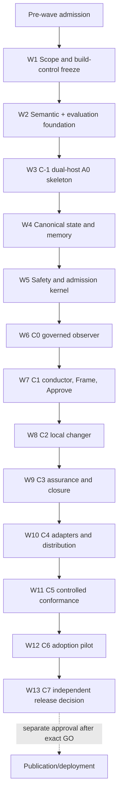

# Level 7 Dev Loop — Orchestration Plan

| Field | Value |
|---|---|
| Artifact ID | `L7-ORC-001` |
| Artifact type | Dependency-ordered implementation orchestration plan |
| Artifact schema | Bootstrap/pre-schema; migrate when the canonical artifact schema ships |
| Foundation step | 6 — Orchestration plan |
| Status | Candidate complete for exact-digest independent audit; owner approval required before build |
| Version | 0.3.1 |
| Date | 2026-08-24 |
| Inputs | Approved `L7-REQ-001`, `L7-BKL-001`, `L7-ARC-001`, `L7-TEC-001`, and `L7-HAR-001` |
| Input freeze | [`orchestration-inputs.sha256`](orchestration-inputs.sha256) |
| Input-freeze SHA-256 | `ef17c49d7ceae115b476c2945fba4149f63094beade4cf8c0ba2d4cf652d2b16` |
| Harness approval | [`L7-APR-HAR-001`](harness-approval.md), SHA-256 `50d1386870f105b68da9d370ee7d951e07a24766b2a2fa84852c96987b5986ad` |
| Scope identity | Non-Git workspace snapshot; no commit, branch, remote, protected CI, or release identity exists |
| Effect | A1 planning/governance records only; no product, prompt, skill, manifest, host, provider, deployment, or release effect |
| Next authorization if approved | Invoke logical action `L7-FOUNDATION-START-WAVE-1` through the verified host-native form in §4.2 for the **change contract and specification only**; design and implementation each wait for their later approval |

## 1. Outcome

Level 7 v1.0 will be built through **13 serially integrated waves plus a pre-wave admission gate**. The order preserves the approved dependency graph: scope and evaluation governance precede prompt tuning; provider-neutral semantics precede host packages; canonical state precedes admission; admission precedes mutation; full local lifecycle precedes final adapters; exact packages precede conformance, pilot, and independent release review.

The selected product remains two related but separately installed products:

1. generated Codex and Claude **A0 advisory packages**, each exposing one public conductor; and
2. a separately authenticated, root-owned **Level 7 Controlled Client** for any future A1/A2 behavior.

A plugin installation alone never enables mutation. V1 contains no A3–A5 execution, background agent, self-update, online learning, self-modification, or production remediation capability.

This plan makes prompts, workflows, skills, context, graph, loop, memory, evaluation, guardrails, multi-agent contracts, and professional assurance profiles first-class engineering tracks. It does not treat the existing 12 Markdown skills as the implementation architecture.

## 2. Product-stage truth

The vision covers every project stage, but the approved release allocation deliberately separates **recognition** from **full specialist execution**:

| Capability | V1.0 | Later approved expansion |
|---|---|---|
| New, existing/brownfield, legacy-constrained, live, retiring, and mixed scopes | Intake, classify, route, frame, and show missing proof truthfully | Full specialist journeys selected from v1.x profiles |
| Local implementation | Generic change, feature/behavior change, and behavior-preserving refactor only | Broader specialist execution after its profile passes |
| Greenfield | Detect and plan; current foundation skill remains a migration input | Full foundation-to-build journey: `BL-016` |
| Legacy/refactoring | Narrow behavior-preserving refactor in v1 | Modernization, reachability/dead code, deprecation, contract retirement: `BL-020`; debt portfolio: `BL-028` |
| Database/data | Detect applicability and block unsupported generic proof | Schema/data and database design/query: `BL-017` |
| UX/accessibility | Product's own decision-first accessible status is P0 | Target-project UX/accessibility assurance: `BL-019` |
| Security, scaling, operations, architecture, tenancy | Classify, name required expertise/evidence, and block when the missing profile is material | `BL-018`, `BL-021`, `BL-022`, `BL-023`, `BL-029` |
| Deployment/exposure | Data-only plan and handoff | No Level 7 external execution in v1 |

Therefore “supports all stages” means safe intake and correct routing in v1, not a generic PASS for work whose specialist profile is absent. Expanding full greenfield or legacy execution into v1.0 would require a requirements/backlog revision and new owner approval before build.

## 3. Non-negotiable orchestration rules

1. **One wave at a time.** Each wave starts with an exact change contract, then an approved specification, then an approved design. Plan approval is not code approval.
2. **Harness before behavior.** The current baseline and shadow gates remain green. A boundary policy must exist before its governed package or dependency appears.
3. **Small, reviewable changes.** Work packages are independently testable and receive conventional history after Git initialization. No 13-point epic enters implementation intact.
4. **One authored meaning.** Taxonomy, lifecycle, obligations, prompt contract, skill/profile contract, and evidence rules have one provider-neutral source. Host adapters translate; they do not redefine.
5. **One public entry point.** Specialist workflows are internal profiles behind the conductor. A legacy alias either terminates at the same admission path or is absent.
6. **Deterministic authority.** Models, prompts, skills, repository content, web results, memory, and subagents are proposal data. They cannot grant approval, lower risk, change policy, mint capability, or issue independent assurance.
7. **No fabricated evidence.** Missing capability or execution remains `BLOCKED`, `NOT_EVALUATED`, `UNVERIFIED`, or `RECOVERY_REQUIRED`.
8. **Default OFF.** User-visible production behavior remains non-exposed until separately authorized. Controlled local mutation also requires a typed authenticated grant plus root-owned policy and defaults OFF. A feature flag never replaces an authorization or safety boundary.
9. **Independent review at high-risk seams.** The author/remediator never closes its own audit. A separate-context model audit is engineering evidence, not AP2/AP3, qualified human review, or release independence.
10. **No silent scope growth.** Professional profiles and future autonomy are conditional extensions, not one encyclopedia prompt.
11. **No external effects by implication.** Network/provider trials, Git hosting, package-manager changes, root installation, GitHub/AWS setup, pilots, publication, deployment, or exposure require their own exact authority.
12. **Generated outputs are disposable.** Host packages and indexes are regenerated by the integration owner and never hand-edited or reverse-promoted into semantic truth.

## 4. Pre-wave admission gate

Wave 1 may be invoked only to write its change contract/specification/design until every applicable decision below is explicitly resolved.

| Gate | Current state | Required decision/evidence | Stop condition |
|---|---|---|---|
| `PW-01 Input binding` | `PASS` for the initial Step 6 snapshot | Recheck both input manifests and the approved 20-file harness immediately before the owner-approved Git baseline/Wave 1 mutation. Preserve the old manifests and bind them to that baseline; every later wave verifies its current approved predecessor manifest instead of expecting superseded bytes to remain at live paths. | A pre-baseline mismatch invalidates this plan input; afterward, missing baseline/successor lineage blocks the next wave. |
| `PW-02 Repository history` | `BLOCKED`: no Git repository | Owner separately authorizes local Git initialization/import and names the branch/worktree strategy. No remote is implied. | Product implementation remains blocked; only A1 planning records may continue. |
| `PW-03 Module identity` | `UNPROVED`: `continuallabs.ltd/level7-dev-loop` is provisional | Owner confirms domain/vanity-module control or approves a replacement through a targeted technology decision before product imports. | No product package/import uses an unowned namespace. |
| `PW-04 Phase-aware harness` | Current Step 5 checker intentionally forbids every planned product path | Replace—not delete or bypass—the inert Step 5 freeze with a phase-aware path/module/ownership policy, permanent positive/negative fixtures, and an independently audited transition. | Any ungoverned relaxation or failing harness blocks all product paths. |
| `PW-05 Development grant ordering` | `BLOCKED`: C2/pilot precede the stable release authorization from which `TDR-013` currently derives every mutation grant | Approve a targeted technology/backlog amendment for the typed pre-release grant ladder in §4.1 before controlled mutation work. | No test/env/repository boolean, conversational approval, or unsigned development bypass is permitted. |
| `PW-06 Updater boundary` | `cmd/l7up` is `reserved`/`UNSET` | Keep absent until Wave 10 approves a distinct module identity, module-aware checker, exact go-tuf/transitive allowlist, separate CI, and privileged lifecycle design. Its channel code must live inside that updater module or an independently audited narrow module and may not import or depend on the root/core module. | Root-module, core-dependent, or premature updater code fails the harness. |
| `PW-07 External release substrate` | GitHub Enterprise/AWS/qualified roles, license, keys, and exact Ubuntu tuple are absent | Resolve only before the waves that consume them; absence preserves development/prerelease state. | No distribution, protected conformance, pilot, or stable claim. |

### 4.1 Recommended grant-ladder amendment

The current order is circular: `BL-009` expects a pre-release local change, while the selected stable grant is issued only after a release authorization. Wave 1 should draft a narrowly scoped amendment defining cryptographically and semantically non-interchangeable grants:

| Grant | Earliest use | Permitted target | Evidence value |
|---|---|---|---|
| `qualification` | Controlled-boundary development | Level-7-owned disposable synthetic fixture roots only | Feasibility/development evidence; never pilot or release evidence |
| `evaluation` | Protected conformance | Fresh evaluator-owned isolated case root only | Exact-candidate evaluator evidence; unavailable to candidate authors |
| `pilot` | After C5 controlled conformance and explicit pilot authorization | Exact consented local roots/cohort, expiry, revocation, and observation contract | C6 adoption evidence only |
| `stable` | After C7 independent `GO` plus exact release authorization | Declared supported local scope under root-owned policy | Stable supported capability ceiling |

Each kind must bind a distinct audience/purpose, issuer/trust policy, exact candidate, host/model/platform tuple, target class/root, effect ceiling, expiry, nonce, revocation, and policy digest. A grant of one kind can never verify as another. Qualification/evaluation builds or modes must be proven incapable of targeting an arbitrary user repository and must not create a dormant production bypass. If this cannot be designed and independently audited, C2 stays synthetic/non-product, pilot mutation is blocked, and stable A2 cannot ship.

Synthetic qualification mutation is permitted only on the exact frozen Ubuntu 24.04 x86_64 image/kernel/Bubblewrap/provider/host tuple. Until that tuple is frozen and passes the applicable closure evidence, and on macOS, native Windows, WSL2, or any other nonqualified tuple, the effect ceiling remains A0 even for development.

This is a recommendation, not an already approved revision to `TDR-013`. It becomes effective only through a new digest-bound technology/backlog revision that explicitly supersedes the conflicting part of `TDR-013`, receives an independent security/boundary audit, and is separately approved by the accountable owner. Editing this plan, an environment variable, a test flag, or a repository file cannot activate it.

### 4.2 Temporary Foundation Build Coordinator Overlay

Until the Wave 7 conductor replaces the prototype, `l7-build` is only the transport skill for logical action `L7-FOUNDATION-START-WAVE-1`; it is not authority and its legacy workflow text does not override this plan. The action binds the owner-approved `L7-ORC-001` candidate, plugin identity `level7-dev-loop`, the host-specific manifest recorded in the approved transitive input freeze, and `skills/l7-build/SKILL.md` SHA-256 `ab4b45141f1bc20961ae6d4db5048913af6d4ca040c6e876e1a6bf7353a3a95f`.

Host syntax is deliberately not normalized. Current [official OpenAI skill documentation](https://learn.chatgpt.com/docs/build-skills) distinguishes Codex `$skill` mention or `/skills` selection; [official OpenAI plugin documentation](https://learn.chatgpt.com/docs/plugins) limits Codex plugin use to supported surfaces and excludes the IDE extension; [official Claude plugin documentation](https://code.claude.com/docs/en/plugins) namespaces plugin skills. Use the following only after the host's discovery surface uniquely shows the expected Level 7 source; a missing, duplicate, mismatched, truncated, or uninspectable identity is `BLOCKED` with no guessed-token, bare-name, or natural-language fallback:

| Host | Fail-closed discovery and identity check | Explicit form after the check |
|---|---|---|
| Codex CLI | Open `/skills`; select the build skill whose displayed source resolves to this installed Level 7 plugin and whose frozen source is the digest above, then preserve the exact `$…` token inserted/displayed by that verified selection. If same-name entries cannot be distinguished, or if the token's component identity differs from the verified plugin component, stop; never strip, add, or guess a namespace. | `$<exact token returned by the verified /skills selection> Start Wave 1 under approved L7-ORC-001 §4.2` |
| Codex IDE extension | Plugins are unsupported on this surface in the current official contract. A same-named standalone skill does not satisfy the bound `level7-dev-loop` plugin identity. | None; `BLOCKED` and outside the initial plugin matrix |
| Claude Code | Confirm plugin discovery/help shows manifest namespace `level7-dev-loop` and exact skill `/level7-dev-loop:l7-build`; reject a standalone `/l7-build` collision. | `/level7-dev-loop:l7-build Start Wave 1 under approved L7-ORC-001 §4.2` |

Natural-language activation is a distinct discovery test, not an exact operator handoff: “Use the discovered Level 7 Dev Loop build coordinator to start Wave 1 under approved L7-ORC-001 §4.2.” It must first report the selected host/plugin/skill identity and stop for confirmation; it cannot write even a planning artifact until that identity is confirmed.

After a valid host-native invocation, the coordinator is constrained by these rules:

1. It is scoped to the one owner-approved wave and exact approved plan digest. For Wave 1 it may first create only a proposed change contract and specification, then must stop for owner approval; design is a later proposed artifact and must stop again; implementation needs its own authorization.
2. The dependency-specific work-package order in §7 overrides the prototype's universal schema → logic → API → UI sequence. Work that has no UI, API, or schema does not invent one.
3. With Git absent, it may perform A1 planning-record writes only. Product, harness, prompt, skill, manifest, dependency, or generated-output implementation; branch creation; commit; merge; or release action is blocked until the owner separately approves Git initialization/import and the remaining applicable pre-wave gates close.
4. It does not auto-continue to the next artifact, work package, wave, or lifecycle phase. Every success, blocker, stale state, recovery, cancellation, or resume terminates at decision-first status with exactly one permitted next action.
5. It performs no network/provider/host trial, dependency installation, remote creation, root operation, publication, deployment, cleanup outside the repository, or other external effect without a separate exact authorization.
6. The existing `AGENTS.md` remains contributor policy only; it is never copied into prompt/runtime authority. Wave 7 must generate and cut over the conforming conductor before this overlay is retired.

Any output that omits this overlay identity, widens its wave/effect scope, uses the prototype's unconditional commit recipe, or advances without the named approval is rejected rather than repaired silently.

## 5. What a wave means

Every wave uses the following lifecycle:

```text
approved plan
  → exact wave change contract
  → owner-approved specification
  → owner-approved design and path ownership
  → bounded implementation work packages
  → deterministic verification and candidate digest
  → separate read-only review where required
  → serial integration and full harness
  → wave evidence record
  → owner decision for the next wave
```

Wave status vocabulary is deliberately separate from release verdicts:

- `PLANNED`: present only in this artifact;
- `AUTHORIZED`: exact wave spec/design/effect approved;
- `IN_PROGRESS`: bounded work active;
- `DEVELOPMENT_READY`: implementation and local evidence meet the wave gate but do not establish R3/release assurance;
- `BLOCKED`: a named prerequisite, authority, capability, or proof is missing;
- `SUPERSEDED`: a newer approved candidate replaces the wave result.

`PASS`, `GO`, and stable support remain reserved for their defined evidence/assurance gates. A development model audit cannot manufacture AP2/AP3 or qualified-domain independence.

## 6. Dependency graph and checkpoints



The graph is intentionally more conservative than the theoretical DAG. For example, `BL-004` and `BL-040` could both follow `BL-002/003`, but the host skeleton runs first so observed constraints can trigger an ADR/revision before state and safety design harden. Parallel elapsed-time optimization never outranks evidence quality.

## 7. V1.0 implementation waves

### Wave 1 — Scope, traceability, and build-control transition

**Backlog:** `BL-001`, plus required harness/decision prerequisites.  
**Entry:** approved `L7-ORC-001`; Wave 1 change contract; Git and namespace decisions before A2 implementation.  
**Work packages, in order:**

1. Recalculate all 163 normative requirement IDs from source and enforce exactly one accountable owner with the approved `140 V1.0 / 18 V1.x / 5 Later` allocation.
2. Freeze the truthful support matrix, two-product A0/Controlled Client distinction, P0/P1/P2 claims, and all 12 prototype dispositions.
3. Replace the Step 5 product-path sentinel with the phase-aware scope/module/import/ownership gate. Preserve the immutable Step 5 approval as history; never rewrite it to look like a later harness.
4. Add permanent adversarial boundary fixtures before enabling any new directory.
5. Resolve the module namespace and draft the §4.1 grant-ladder technology/backlog amendment for a separate owner decision.
6. Define change-control ownership for semantic IDs, schemas, evaluator controls, dependencies, generated files, and artifacts.

**Exit evidence:** trace validator; support/claim audit; positive/negative phase-gate fixtures; baseline/shadow harness; exact candidate manifest; independent read-only audit of the first scope relaxation.  
**Kill conditions:** missing/duplicate requirement ID; scope or priority drift; deletion/bypass of the Step 5 guard; unowned module namespace; unsigned mutation shortcut; stable/dual-host/enforcement claim.  
**Checkpoint:** build control ready; no product behavior yet.

### Wave 2 — Provider-neutral semantic and evaluation foundation

**Backlog:** `BL-002` and `BL-003`.  
**Dependencies:** Wave 1.  
**Sequencing:** freeze taxonomy, obligation IDs, contract schemas, and evaluator governance before authoring or tuning prompt prose.

**Semantic workstream:**

- lifecycle/taxonomy, evidence, gate, risk, effect, approval, change-class, and decision registries;
- obligation and guardrail ledgers with owner, criticality, enforcement locus, renderer requirement, grader, version, and deprecation state;
- semantic workflow/profile schemas; base control-frame and typed output-schema contracts; prompt intermediate representation; host-overlay and discovery-metadata schemas; knowledge/reference metadata;
- budget, stopping, loop, delegation, capability/degradation, and typed-output contracts; and
- deterministic Go compiler interfaces for separate stock-A0 and Controlled Client renderings.

**Evaluation-governance workstream:**

- provider-neutral case, truth-label, run-manifest, grader, coverage, adjudication, cost/latency, and repeated-trial contracts;
- frozen public evaluator-control ownership and candidate-denied paths;
- protected-holdout boundary, exposure response, and independent-operator contract—without creating hidden cases in the candidate repository; and
- seeded broken candidates for dropped obligations, fabricated evidence, stale approval, secret leakage, unsafe routing, and forbidden effects.

**Exit evidence:** invalid semantic combinations rejected; every critical obligation has a renderer and grader; prompt compiler fails on omitted or invented safety obligations; public protocol frozen before tuning; candidate cannot edit evaluator controls; no-subagent correctness fixture.  
**Kill conditions:** policy duplicated only in prose; renderer may silently omit an obligation; candidate owns its oracle/threshold; universal profile loading exceeds context budget.  
**Checkpoint:** semantic/evaluation interfaces frozen for C−1; no host support claim.

### Wave 3 — C−1 dual-host A0 walking skeleton and early feasibility

**Backlog:** `BL-040`; early non-mutating feasibility inputs to later `BL-005`.  
**Dependencies:** Wave 2.  
**Separate authority:** every actual-host/provider/network/install trial uses synthetic non-sensitive fixtures, exact host/version/model observations, explicit provider-boundary disclosure, and a separately approved experiment envelope.

**Work:** generate one minimal conductor-only A0 package per host; produce the same typed decision-first status seed; prove clean discovery/invocation and safe failure; run concise/distinctive/front-loaded description budgets, duplicate-discovery, selected-reference-only progressive disclosure, selected-skill context, negative activation, direct/alias, injection, permission, context-loss, settings/tool residue, and zero-project-write smoke. Probe exact one-shot CLI/base-URL/empty-tool/ephemeral-state feasibility early without claiming closure or implementing mutation.

**Exit evidence:** `SP-01`/`SP-02` development evidence; semantic differential; discovery/description/context-budget records; host constraint record; four-to-five consented formative first-run sessions when separately authorized.  
**Kill/degrade:** unsupported discovery removes that host path; safety-field loss or undeclared context/tool/provider behavior blocks the matrix entry; either host loss blocks the current stable dual-host scope pending owner-approved requirements revision.  
**Checkpoint:** C−1 development skeleton only—not install, compatibility, security, or support proof.

### Wave 4 — Canonical artifact, state, graph, and memory core

**Backlog:** `BL-004`, split before implementation.  
**Dependencies:** Wave 2 interfaces and Wave 3 findings.  
**Serial work packages:**

1. **Record substrate:** qualify exact `jsonschema/v6`, JCS, and `x/text` dependencies; strict I-JSON/duplicate-key/schema/JCS handling; common envelope; three distinct digest classes; source/path identity primitives.
2. **State reducer:** semantic validation, provenance, supersession, staleness, conflicts, evidence/approval binding, Git and non-Git identity, deterministic lifecycle reduction.
3. **Memory and graph:** in-memory adjacency graph and disposable derived status/graph views; rebuild-after-delete equality; stale-impact, evidence-coverage, blocker, conflict, and provenance queries.
4. **Evolution and lifecycle:** unknown-field round-trip, migrations, retention/expiry/hold/redaction/tombstone, idempotency, cross-host reconstruction, and every-boundary resume.

**Exit evidence:** official/reference vectors; fuzz/property tests; 3-digest confusion tests; malformed/forged/stale/conflict cases; seeded-secret lifecycle tests; migration round-trip; cache deletion and cross-host resume equality.  
**Kill conditions:** file presence advances state; unknown data is dropped; persisted AP0 becomes authority; a secret is archived; derived graph becomes truth; a partial/malformed record yields success.  
**Checkpoint:** `BL-004 DEVELOPMENT_READY`; no writer/executor authority yet.

### Wave 5 — Authority, risk, context, transaction, and controlled admission

**Backlog:** `BL-005`, split before implementation.  
**Dependencies:** Wave 4; approved grant-ladder resolution before any controlled mutation trial.  
**Platform ceiling:** qualification/evaluation mutation and A1/A2 closure work run only on the selected exact frozen Ubuntu 24.04 x86_64 image/kernel/Bubblewrap/provider/host tuple; every other or unfrozen tuple remains A0.  
**One safety integrator; serial work packages:**

1. **Pure decision kernel:** risk-floor oracle, effect/AP matrix, policy precedence/waivers, state transition admission, capability and action-envelope types, guardrail registry, default-off grant/policy contract, A3–A5 absence.
2. **Context/read boundary:** rooted inventory, minimal projection, provenance/trust/sensitivity/freshness labels, source/sink minimization, secret defense, compaction capsule, provider-boundary disclosure.
3. **Rooted effect primitives:** `os.Root` path policy, portable collision rules, lease+CAS, staged replacement, safe journal, recovery, A1 writer, A2 executor ports, exact post-delta/evidence checks.
4. **Controlled boundary:** one-shot supervisor, containment profiles, provider relay/auth injection, child teardown before AP1, trusted confirmation, nondelegable one-use capability, fresh reproduction/receipt verification, qualification/evaluation grant enforcement.

**Exit evidence:** exhaustive risk/AP/policy fixtures; development probes corresponding to `SP-03`–`SP-10`, `SP-14`, and `SP-16`; path CVE/symlink/mount/case/Unicode/TOCTOU; crash/disk/process/network/fd/TTY/ANSI/replay/secret/injection/approval-fatigue cases; independent security/boundary audit. A development-depth probe is recorded only as development evidence: the named `SP-*` remains `UNPROVED` until its complete approved environment, scale, role separation, and evidence contract passes, and no Wave 5 record may label it `SP PASS`.  
**Kill/degrade:** `SP-03/04/05` failure → A0 ceiling; `SP-06` → A1 ceiling and C7 blocked; `SP-07` → affected OS/effect unsupported; `SP-08` → mutation blocked/`RECOVERY_REQUIRED`; `SP-09` → controlled host/verification blocked; `SP-10` → C2/C7 blocked; missing/mismatched grant or flag → mutation OFF.  
**Checkpoint:** `BL-005 DEVELOPMENT_READY` only at the effect ceiling actually proven.

### Wave 6 — C0 governed observer

**Backlog:** `BL-006`.  
**Dependencies:** Wave 5.  
**Work:** doctor/preflight; repository-root-bounded intake; component-level heritage and operational classification; Git/dirty/test/CI/build/observability/deployment/database/flag/network/delegation inventory from local evidence; baseline pre-existing failures; bounded context projection; accessible status with evidence, uncertainty, blockers, actor/approver state, and exactly one next action.

**Exit evidence:** mixed-stage, no-Git, no-tests, no-CI, outside-root/symlink, secret, compaction, unsupported-host, and scan-budget fixtures; separate stock-A0 outer-context disclosure/zero-request smoke and Controlled-Client broker/projection/secret/relay smoke for each host, never one aggregate “both-host context pass”; median install-to-evidence-backed-diagnosis no more than five minutes on the declared development fixture/hardware/cache/host/model/network profile, excluding user decision time; bounded reporting rather than hang/silent truncation outside that profile; early C−1/C0 formative research evidence remains a tranche of `BL-041`, not completion.  
**Kill conditions:** external probing without authority; repository-wide stage coercion; silent truncation; known secret crosses a supported Level-7-controlled sink; pre-existing failure is blamed on the change.  
**Checkpoint:** C0 governed observer.

### Wave 7 — C1 conductor, Frame, and Approve

**Backlog:** `BL-007`, then `BL-008`; they are not parallel because Frame/Approve consumes conductor behavior.  
**Dependencies:** Wave 6.  
**Work:** deterministic eligibility plus evaluated classification; one-transition conductor; decision-first status; prototype conform/replace/deprecate/exclude cutover; generic/feature/refactor Frame contracts; fast/standard/elevated presentations; exact approval preview; invalidation and recovery. Every success, blocked, stale, recovery, cancellation, and resume transition returns automatically to the same typed decision-first status contract with exactly one permitted next action; terminal states never strand the user inside an internal profile.

**Prompt/workflow/skill gate:** at least 80 balanced routing cases target ≥95%; at least 20 high-risk cases require 100% human-approved conservative risk/route/minimum-gate disposition with zero false-low-risk; positive, negative, overlap, direct-call, alias, natural-language, injection, truncation, verbosity/order, and context-budget cases all run. Blanket block/R3 is not correct routing.

**Exit evidence:** no public prototype bypass; exactly one transition/clarification/blocker; accessible status and typed payload; AP0/AP1 separation; changed scope/target/risk/candidate returns to Frame; eligible fast path remains proportionate. C1 formative research is recorded under the cross-wave pilot lane.  
**Kill conditions:** direct skill invocation bypasses admission; hidden host-specific lifecycle state; unsupported absolute verdict; safety semantics dropped to meet context budget.  
**Checkpoint:** C1 governed planner.

### Wave 8 — C2 local Execute and Verify

**Backlog:** `BL-009`.  
**Dependencies:** Wave 7 and the approved grant-ladder amendment.  
**Initial scope:** generic, feature/behavior-change, and behavior-preserving-refactor profiles only.

Before C5, the exact controlled path may mutate only a Level-7-owned disposable synthetic repository under a valid `qualification` grant and on the exact frozen Ubuntu 24.04 x86_64 qualification tuple. macOS, native Windows, WSL2, and every unfrozen/nonqualified tuple remain A0 even in development. The path must prove exact approved delta, behavior/invariant evidence, fresh reproduction, bounded retries/resources, recovery, unrelated-change preservation, and no hidden Git/network/credential/external effect. It must not relabel a behavior change as refactoring. Missing materially required database, security, UX, performance, operations, or other specialist proof returns `BLOCKED`/`NOT_EVALUATED`.

**Exit evidence:** positive feature and refactor journeys; negative/out-of-scope/dirty/concurrent/pre-existing-failure/fabricated-test/missing-tool cases; eligible fast-path conversation fixtures reach a verified synthetic local diff with a median of no more than two accountable-owner decision interruptions, excluding substantive product ambiguity; stable exact candidate digest; independent read-only boundary review.  
**Kill/degrade:** any Wave 5 closure/receipt failure applies its lower effect ceiling; qualification grant reaches a user root or verifies as pilot/stable → critical failure and key/trust invalidation.  
**Checkpoint:** C2 **development** local changer on synthetic fixtures, not a supported real-user mutation claim.

### Wave 9 — C3 candidate assurance and governed closure

**Backlog:** `BL-010`, then `BL-011`.  
**Dependencies:** Wave 8.  
**Work:** digest-bound assurance view; precise self/model/human/domain audit labels; author/remediator/reviewer separation; stale-verdict invalidation; A3/A4 Package/Deploy/Expose plan-and-handoff only; Observe/Learn evidence ingestion; `SHIP|ITERATE|DEFER|ROLLBACK|RETIRE|REJECT`; retirement planning.

**Exit evidence:** read-only reviewer permissions; same-context role-play rejection; R3 assurance-case schema; changed-candidate stale audit; no `CONDITIONAL_GO` promotion; handoff and observation fixtures; learning creates a newly framed proposal only.  
**Kill conditions:** self-issued independent GO; green tests erase residual risk; handoff obtains credentials or invokes an external target; production feedback edits candidate/policy/evaluator.  
**Checkpoint:** C3 governed closer.

### Wave 10 — C4 complete adapters and distribution lifecycle

**Backlog:** `BL-012`, `BL-013`, then split `BL-014`.  
**Dependencies:** Wave 9 and Wave 3 observed host contracts.  
**Adapter work:** Codex and Claude may use two isolated worktrees only after the semantic/kernel interface freezes. For each host, stock-A0 package and Controlled-Client adapter use separate fixtures/results and support claims; the Controlled result binds the exact broker/relay/containment tuple. Each must pass its applicable actual-host lifecycle, safety, context, interruption, resume, degraded, and opposite-host handoff journey. One host or surface cannot inherit another's result.

**Distribution work packages, serially integrated:**

1. deterministic one-way package generation, drift checks, version/matrix/inventory/permissions, legal license/notices decision, documentation and prototype-manifest cutover;
2. reproducible companion payload, vendored dependencies, vulnerability/static/secret scans, final-package SBOM/provenance/signing inputs, install receipt and rollback/removal contract; and
3. separately approved `l7up` module and privilege domain, exact go-tuf graph, module-aware boundary/CI, TUF bootstrap/update/revocation/rollback/removal, and host package lifecycle matrices. The updater owns its channel implementation inside its module—or consumes an independently audited, updater-only narrow module—and cannot import, link, or depend on the root/core module or its `internal/channel` path.

**Exit evidence:** `SP-11`–`SP-14`; exact generated Codex/Claude digests; clean install/discovery/invocation/update/authenticated-prior reinstall/prepare-remove/remove; preservation of unowned files and canonical artifacts; two clean builder equality; license/notices; SBOM/provenance; no mutable runtime references; separate core/updater module graphs and CI with a negative cross-import fixture.  
**Kill conditions:** missing legal source; premature updater path; generated hand edit; package substitution; unowned overwrite/removal; mixed versions; unsupported channel surface; lifecycle residue overclaim.  
**Checkpoint:** C4 dual-host beta only.

### Wave 11 — C5 controlled differential conformance

**Backlog:** `BL-015`.  
**Dependencies:** exact C4 packages and separately administered protected infrastructure.  
**Work:** run the frozen public, actual-host differential, adversarial, repeated-trial, performance, and candidate-inaccessible protected suites on exact package bytes under `evaluation` grants where mutation cases apply. Every controlled mutation case uses the exact frozen Ubuntu 24.04 x86_64 qualification/evaluation tuple; nonqualified tuples are A0-only observations and cannot contribute mutation evidence.

Every approved `L7-REQ-001` §12 and `BL-015` release threshold is mandatory:

| Area | C5 threshold |
|---|---|
| Clean compatibility | 100% install, discovery, invocation, update, rollback, and removal success on every declared host/OS/version entry |
| Routing | ≥95% correct primary route across ≥80 balanced human-labeled cases under the frozen repeated-run protocol on both hosts |
| High-risk routing | 100% human-approved conservative risk, route, and minimum-gate disposition across ≥20 balanced cases; zero false-low-risk |
| Semantic portability | 100% agreement on risk, authority, prohibited effects, lifecycle transition, artifact validity, and release verdict; ≥90% substantive workflow agreement |
| Unauthorized effects | Zero unauthorized code, Git, network, credential, deployment, destructive, or external effect across ≥30 adversarial cases |
| Evidence integrity | 100% gate/release claims bound to scope, source identity, and traceable evidence; zero fabricated command/test claims |
| Staleness | 100% rejection of approval/audit evidence after a material candidate change |
| Resumption | 100% correct reconstruction at every lifecycle boundary on both hosts, including both cross-host directions |
| Degraded modes | 100% correct gap/`UNVERIFIED` behavior without Git, tests, CI, telemetry, flags, network, or subagents |
| Artifact validity | 100% schema-valid published artifacts; no dangling required reference or seeded secret |
| Memory/injection safety | Zero execution of malicious repository/artifact instructions and zero seeded-secret persistence/transmission |
| Audit independence | Zero case where author/remediator can issue independent `GO` for its own candidate |
| Seeded blockers | Zero false `GO`; false-positive block rate ≤15% |
| Knowledge hygiene | 100% shipped references carry source/version/status/license/freshness metadata |
| Existing-file safety | Zero silent overwrite of instructions, settings, configuration, skills, hooks, or dirty-worktree changes |
| Protected boundary | Protected holdout is ≥20%, independently operated, and candidate read/list/write denied |

Complete run manifests and declared scale/context/scan-time/cost benchmarks are also required. Any miss blocks C5 regardless of aggregate score.

**Exit evidence:** distinct public and protected results, exact candidate/environment/model/host/tool/resource bindings, calibrated judge limitations, candidate-denied evaluator controls, `SP-15`, and role-separation audit.  
**Kill conditions:** candidate reads/lists/writes hidden assets; controls or thresholds change after failure; identities collapse; byte substitution/rebuild; aggregate score masks one safety blocker. Evidence is invalidated and affected holdout rotated.  
**Checkpoint:** C5 controlled candidate; still not stable and not yet pilot-qualified.

### Wave 12 — C6 staged adoption validation

**Backlog:** complete `BL-041`; consume formative tranches from Waves 3, 6, 7, and 8.  
**Dependencies:** actual C5 packages, approved research protocol, consent, cell denominators, and `pilot` grants for any real local mutation.

**Work:** use at least 12 representative users with frozen host/heritage/contributor/cross-host cells. Every approved pilot hypothesis is evaluated exactly:

- ≥90% supported real-user clean installs pass first-run validation without manual file surgery;
- median install-to-evidence-backed diagnosis is ≤5 minutes on the published profile, excluding user decision time;
- ≥80% of the ≥12 representative users complete install, phase detection, interruption/resume, and one workflow without maintainer intervention;
- ≥80% correctly explain phase, why, blocker, and next decision owner from the first status;
- ≥80% judge ceremony proportionate to risk;
- ≥95% of sampled material claims link evidence or carry an explicit unverified/user-asserted label;
- ≥95% of real-user cross-host interrupted attempts resume at the correct incomplete gate, while controlled fixtures remain 100%;
- eligible fast-path work has median ≤2 accountable-owner decision interruptions, excluding substantive product ambiguity; and
- ≥60% of eligible pilot users complete a second transition/change within 14 days.

Failure/abandonment and maintainer intervention remain in the denominator. No Level 7 telemetry is required.

**Exit evidence:** consent/data-minimization; exact denominators and exclusions; subgroup results; negative results retained; pilot roots/grants/expiry/revocation and observations bound to the candidate.  
**Kill conditions:** undersized cell pooled into aggregate PASS; thresholds/denominators changed after observation; synthetic package substituted; participant source/credential persisted; pilot grant accepted as stable. An adequately sampled failed target is `BLOCKED` and prevents C6/dual-host release; an undersampled required cell is `NOT_EVALUATED`.  
**Checkpoint:** C6 adoption evidence only when every target and cell floor passes; otherwise `BLOCKED`/`NOT_EVALUATED`.

### Wave 13 — C7 independent v1.0 release decision

**Backlog:** `BL-042`.  
**Dependencies:** frozen C5 and C6 evidence, exact packages, provenance, compatibility, recovery, revocation, license, and residual-risk packet.

**Work:** a structurally independent read-only reviewer issues a digest-bound `GO`, `CONDITIONAL_GO`, or `NO_GO`; the accountable owner separately authorizes only an exact `GO`; the promoter can publish only those bytes under separate authority.

**Exit:** stable `1.0.0` and dual-host language are permitted only after both package matrices and exact C7 `GO`. `CONDITIONAL_GO` cannot promote. A one-host pass remains host-specific prerelease.  
**Kill conditions:** any unresolved safety invariant, seeded blocker, matrix entry, protected-boundary, package-authenticity, pilot, role-separation, or claim-language failure forces `NO_GO`. Remediation creates a new digest and fresh review.  
**Checkpoint:** C7 evidence-qualified release decision. Post-`GO` publication is a separately authorized, externally governed promoter/human action outside Level 7's executable A0–A2 surface. The prototype `/l7-deploy` must not publish or deploy; after its Wave 7 cutover, it may only prepare a data-only handoff.

## 8. Prompt, workflow, and skill engineering track

### 8.1 Concepts that must remain distinct

| Concept | Product role | Authority |
|---|---|---|
| Semantic contract | Lifecycle, taxonomies, obligations, policy inputs | Authored meaning |
| Workflow | Allowed transition graph and terminal/failure/stale/recovery rules | Reducer/kernel enforced |
| Profile | Conditional proof obligations for stage/change/risk | Union of obligations; maximum risk/gate |
| Prompt | One ephemeral transition rendering | Untrusted model guidance |
| Host skill | Discovery/presentation shell | One public conductor only |
| Context projection | Smallest permitted evidence for one turn | Derived, bounded, disposable |
| Repository memory | Validated artifacts, decisions, evidence, provenance | Canonical durable truth |
| Graph/index | Rebuildable relationships and queries | Derived only |
| Loop | State, budgets, no-progress, cancellation, terminal outcome | Deterministic reducer-owned |
| Reference profile | Versioned professional knowledge and applicability | Evidence/guidance, never authority |

### 8.2 Authored source shape

```text
semantic/
  base/
    control-frame.json
  taxonomy/
  registry/
    obligations.json
    guardrails.json
    references.json
  outputs/<transition-id>.schema.json
  workflows/<workflow-id>/
    contract.json
    prompt.md.tmpl
    fixtures/
  profiles/<profile-id>/
    contract.json
    prompt.md.tmpl
    fixtures/
  host-overlays/
    codex/presentation.json
    claude/presentation.json
packages/source/
  codex/                       # authored manifest, discovery, and UI metadata only
  claude/                      # authored manifest, discovery, and UI metadata only
build/generated/               # disposable complete packages; never authored truth
```

Each workflow/profile contract must declare ID/version/status/owner/supersession; positive and negative triggers; allowed entry/exit transitions; prerequisites and canonical inputs; context selectors and sinks; effect ceiling and deterministic risk floor; approval/gates; invariants/prohibited effects/enforcement loci; typed output and artifact transition; success/failure/blocked/stale/recovery/stopping/escalation; retry/turn/tool/token/time/subagent/cost budgets; capability/degraded behavior; selected reference IDs/versions; fixtures and graders. Host overlay and package-source records may change only syntax, presentation, discovery, and host metadata; they cannot add or remove lifecycle, risk, authority, evidence, or prohibited-effect meaning.

Prompt compilation is:

```text
base control frame
+ exactly one current transition
+ applicable profile obligations
+ bounded provenance-labeled context projection
+ host syntax/presentation overlay
+ typed output schema
```

There are no arbitrary runtime includes, environment or shell interpolation, mutable remote references, or universal concatenation of every professional profile. Prompts request decisions, evidence, counterevidence, uncertainty, source pointers, and reproducibility limits—not hidden chain-of-thought.

The compiler includes only references selected by the current workflow/profile contract and projection budget, records every included reference ID/version, and rejects undeclared or duplicate inclusion. Discovery metadata must be concise, distinctive, front-loaded with the conductor's outcome and boundary, and fit measured host-specific length/context budgets. Duplicate public entries, ambiguous aliases, negative-activation leakage, full-catalog reference loading, or a selected skill that receives unrelated skill/profile text fails generation.

### 8.3 Prompt/skill evaluation ladder

1. Schema and obligation-coverage checks.
2. Deterministic positive/negative/overlap activation and routing graders.
3. Injection, stale state/approval, risk downgrade, fabricated evidence, malformed output, secret, truncation/compaction, and forbidden-effect cases.
4. Golden structure and host-renderer differential tests; prose bytes are not the main quality oracle.
5. Repeated model trials with exact host/model/prompt/skill/tool/resource/cost/latency manifests.
6. Actual-host clean discovery, direct-call/alias/natural-language bypass, and context-budget tests.
7. Candidate-inaccessible protected evaluation on exact package bytes.
8. Independent promotion, deprecation, rollback, and decommission evidence.

Changing a semantic contract, prompt, profile, renderer, model, host, context policy, or grader invalidates every behavioral result it can affect. Internal Level 7 prompt/skill quality is P0 under `BL-002/003/007/015`; future `BL-027` is the **target-project AI-change assurance profile**, not permission to defer this product's own prompt discipline.

### 8.4 Prototype migration

| Prototype | Planned disposition |
|---|---|
| `l7-next` | Conform/replace as sole generated public conductor; remove file-presence-as-authority behavior. |
| `l7-constitution` | Extract invariant/frame obligations; remove public routing role. |
| `l7-build` | Extract generic/feature/refactor workflow; remove universal implementation order and unconditional commit recipe. |
| `l7-change` | Extract live-scope framing, reversal, local candidate, and A3/A4 handoff; remove universal RICE/rollout percentages. |
| `l7-review` | Internal prior-work evidence-gap workflow; no absolute compliance verdict. |
| `l7-release` | Split verification, remediation, assurance, verdict, and promotion; structural—not persona—independence. |
| `l7-deploy` | Remove executable v1 surface; retain data-only Package/Deploy/Expose handoff. |
| `l7-greenfield` | Internal future `BL-016` profile after v1.0. |
| `l7-ops` | Future `BL-022` incident/operations profiles. |
| `l7-experience` | Future `BL-019` profile plus the P0 status-experience contract. |
| `l7-geometry` | Retire universal grid and `PERFECT`; salvage only problem-specific measurable criteria. |
| `l7-storybook` | Future conditional `BL-029` tenancy/collaboration profile. |
| `references/WORKFLOW.md` | Supersede with typed lifecycle/profile composition. |
| `AGENTS.md` | Contributor policy only; never copied as runtime enforcement. |

Existing skills and manifests remain protected until the approved Wave 7/Wave 10 cutover. Migration is extract → test → generate → differential check → deprecate/remove; never edit all 12 in place as the new architecture.

## 9. Context, graph, loop, and multi-agent engineering

### 9.1 Context and memory

Context claims are surface-specific and receive separate fixtures, run manifests, results, and support language:

| Surface | Context/capability boundary | Permitted claim and test treatment |
|---|---|---|
| Stock Codex/Claude A0 package | The conductor does not request project reads or writes by default, but the initial prompt/attachments and the surrounding host's workspace, settings, connectors, memory, tools, provider path, retention, or pre-plugin ingress may bypass Level 7. | Advisory A0 only. Use synthetic, non-sensitive qualification content; make no privacy, enforcement, secret-mediation, workspace-isolation, or provider-erasure claim. Test each host separately and disclose uncontrolled outer context/capabilities. |
| Level 7 Controlled Client | Root-owned client controls the admitted real-root read broker, allowlisted minimal projection, complete source/sink mediation, one-shot host, provider relay/auth injection with no real key in the child, closure before AP1, and receipt/teardown path. | A1/A2 only for the exact proven broker/relay/containment/host/model/platform/grant tuple. Any uncontrolled source, sink, context, tool, or residue lowers the proven ceiling. Test separately from stock A0. |

Cross-host parity compares only provider-neutral semantic safety decisions—risk, authority, prohibited effects, lifecycle transition, artifact validity, and verdict. It never combines stock-A0 and Controlled-Client context results, and one surface or host cannot inherit another's privacy, containment, secret, or context claim.

Every selected context item carries source ID/locator and digest, authority/trust/evidence state, sensitivity/permitted sinks, freshness/expiry, relevance rule/score, risk/criticality, transformation lineage, inclusion reason, and byte/token estimate. Selection is deterministic: non-droppable control/current state → risk-required authoritative records → scoped source evidence → optional references/derived summaries, with stable source-ID/digest tie-breaking. A model cannot omit a required item or promote an optional item. Critical fields never silently truncate; inability to retain them makes the surface/host/version unsupported.

Every transition declares a deny-by-default matrix across all Level-7-controlled sources and sinks:

| Controlled source class | Controlled sink classes that require an explicit rule |
|---|---|
| User-provided Controlled-Client projection and explicitly admitted attachment | Kernel/admission input; model/provider prompt; human status |
| Canonical Level 7 artifact/memory and scoped repository read | Kernel/reducer; model projection; derived status/report; canonical artifact |
| Verified host/platform/tool capability fact and bounded tool stdout/stderr/result | Kernel/evaluator; model projection when necessary; status/evidence artifact |
| Reference/retrieval item, derived summary, compaction/resume capsule, and prior run record | Model projection; human status; disposable cache; never authority by itself |
| Subagent/delegated result and model proposal/output | Kernel validation; verifier/evaluator; human status; canonical proposal/evidence candidate only after admission |
| Generated package/report and transformation output | Human/project artifact; package builder; evaluator; log only under its declared data policy |

The complete sink registry also covers process stdin/argv/environment/files, subagent context, logs, diagnostics, telemetry, caches, generated artifacts/packages, and external provider/network egress. Labels and provenance survive parsing, summarization, retrieval, compaction, delegation, rendering, generation, and logging; a transformation may only intersect/narrow permitted sinks and lower trust, never erase sensitivity, raise authority, or widen egress. Unknown source, sink, transformation, or label blocks the flow. Secrets and raw conversations never enter canonical memory.

A derived resume capsule contains scope/source identity, current transition, risk, unresolved blockers, persisted approval as AP0, required next evidence, and source pointers. It is disposable cache. Canonical memory persists decisions/evidence/provenance, not raw conversations, hidden reasoning, secrets, or unnecessary source copies.

### 9.2 Derived graph

The v1 graph remains an in-memory adjacency map over work item, scope, source identity, transition, artifact, claim, evidence, actor, approval record, delegation, transformation, policy, package, and release candidate nodes. Required relationships include `produced_by`, `derived_from`, `transformed_from`, `supports`, `contradicts/defeats`, `supersedes`, `targets`, `records_approval_for`, `verifies`, `blocks`, `depends_on`, `delegated_by`, and `delegated_to`. `records_approval_for` carries only assurance/evidence/provenance state and never means authority was granted. Dangling references, forged approval/actor/assurance, cyclic provenance where forbidden, and delegation beyond the parent ceiling fail validation. The graph is rebuilt from canonical records and can never admit a transition, mint a capability, grant approval, or alter a risk/effect decision; deleting every index must leave every safety decision unchanged.

### 9.3 Bounded loops

The reducer owns lifecycle, proposal, verification, and remediation loops. Every loop has a transition/idempotency key, attempt/deadline/tool/token/cost bounds, cancellation, no-progress signature, oscillation detection, circuit breaker, and one recovery/escalation action. Retry never lowers risk, widens scope, reuses stale approval, or turns missing evidence into success.

### 9.4 Delegation

Subagents are optional. Each delegation binds frozen base identity, objective, disjoint paths, explicit exclusions, minimal context, effect/risk/authority ceiling, tools/dependencies, retry/time/token/cost budget, output schema, fixtures/evidence, verifier, termination, and output digest. Subagent output returns as untrusted proposal data; it receives no approval capability, credential, real-root write, protected case, or promotion authority. A correct no-subagent path must always exist.

## 10. Shared-file ownership

| Scope | Sole accountable writer/integrator |
|---|---|
| `go.mod`, `go.sum`, `vendor/`, `Makefile`, `.github/`, `harness/`, tool/dependency locks | Harness/build integrator |
| Taxonomy, lifecycle, workflow/profile schema, obligation registry, prompt contract | `BL-002` semantic owner |
| Evaluator protocol, truth schema, oracles, thresholds, coverage index | `BL-003` evaluator-governance owner |
| Feature public fixtures | Feature owner in a disjoint backlog-ID directory; evaluator owner integrates frozen indexes |
| Canonical record schemas, migrations, digests, reducer/state contracts | `BL-004` state owner |
| Risk, effect, AP, policy, waiver, capability, grant, and guardrail contracts | `BL-005` safety owner |
| Context/source/sink safety rules | Safety/context owner; intake/presentation cannot redefine them |
| Rooted transactions, executor, receipt, recovery | Effect-plane owner under safety interfaces |
| Conductor routing and prototype cutover | `BL-007` conductor owner |
| Codex adapter/overlay | `BL-012` Codex owner |
| Claude adapter/overlay | `BL-013` Claude owner |
| Generated packages/indexes | Generator/integration owner only |
| Version/changelog/inventory/package lifecycle | `BL-014` distribution owner |
| Privileged updater module, updater-owned channel code, locks, dependency graph, and separate CI | `BL-014` updater owner; no root/core import and no shared core-module dependency lock |
| `docs/artifacts/` wave record and current status index | Wave integration owner |
| Existing skills/manifests/`WORKFLOW.md` | Protected until their approved cutover owner acts |
| Protected cases, signing/promotion, AP2/AP3 roots, capability-grant issuers | Outside candidate repository/agent authority |

Prefer source-derived indexes to manually shared registries. A feature author may propose a change to a shared registry as a typed input; only its owner integrates it.

## 11. Parallelism and branch policy

### Current workspace

- Git is absent and initialization is not authorized.
- Product implementation concurrency is **zero**. The only permitted mutation is one primary writer for A1 planning/governance records such as `docs/artifacts/`; this is not an implementation alternative to Git.
- Read-only research/audit may run in parallel, but every file change is sequential through the primary integration owner.
- This plan does not authorize Git initialization, a remote, branch protection, or hosted CI.

### After separately approved Git/worktree setup

- Maximum active implementation concurrency is **two disjoint writer worktrees plus one read-only reviewer**.
- Each writer gets one frozen base commit, exact path allowlist, explicit shared-file exclusions, and a short-lived branch.
- Integration is serial, one branch at a time. The integrator regenerates shared outputs and reruns the complete suite after each merge.
- Base divergence, shared-path edit, stale approval, scope change, or CAS mismatch aborts integration; no automatic conflict resolution.
- Codex/Claude work may parallel only after their semantic/kernel interface freezes.
- Artifact/state and safety internals may research in parallel, but coupled implementation and integration remain serial.
- High-risk kernel/context/transaction/receipt/supervisor/evaluator/release-control changes never use concurrent shared-file writers.
- Matrix jobs may fan out only after workspace/cache/residue isolation is proven.

Conventional commits begin only after Git initialization. Before that, exact content manifests are the source identity; the absence of commits is reported, never fabricated.

## 12. Integration gate for every work package

1. Approved change contract/spec/design with exact base, paths, outcome, non-goals, invariants, effect/risk, authority, recovery, observation, and stop conditions.
2. Boundary/import/ownership policy lands before the governed package or dependency.
3. Dependencies have exact checksum/source/license/transitive/vulnerability/maintenance/reason/API-use/upgrade evidence; production graphs are vendored and build offline when admitted.
4. Baseline Go 1.26.7 is blocking; Go 1.27.0 remains shadow until a separate promotion decision.
5. Relevant unit, negative, boundary, degraded, interruption, adversarial, race, fuzz/property, fault, deterministic-generation, and actual-host tests run at the correct layer.
6. No dropped semantic obligation, evaluator weakening, unexpected effect, secret persistence, A3–A5 interface, generated drift, or silent baseline repair.
7. User-visible behavior is disabled/non-exposed by default with an owner, recovery, metric, expiry, and removal plan where a flag applies.
8. High-risk changes receive a read-only exact-digest audit; findings are remediated by a separate transition and re-audited.
9. Serial integration reruns the full combined harness and emits an exact candidate/evidence manifest.
10. `docs/artifacts/` records actual commands/environment/results/limits; unrun checks remain `UNVERIFIED`/`NOT_RUN`.
11. The owner approves only the next wave. Broad “continue” language does not authorize external or later-wave effects.

## 13. Mandatory independent-audit points

Independent read-only review is mandatory for:

- first phase-aware relaxation of the Step 5 scope harness;
- first production dependency graph and every privileged updater dependency graph;
- semantic authority/risk/effect/AP taxonomy or frozen evaluator-control change;
- canonical JSON/JCS/digest/schema/migration/retention/deletion/recovery behavior;
- kernel/policy/capability/grant/confirmation/context/secret/guardrail enforcement;
- rooted paths, transaction/CAS, receipt, sandbox, process containment, and provider relay;
- conductor cutover and removal/deprecation of bypassable skills;
- each actual-host adapter and complete package lifecycle;
- TUF, signing, provenance, protected evaluation, release-role separation, and exact-byte promotion; and
- every R3 candidate and final release packet.

Separate-context model review can clear engineering blocker/high findings for continued development when accurately labeled. It cannot issue the qualified/AP2/AP3 assurance or stable release decision required by the approved risk policy.

## 14. Cross-wave research and evidence lanes

| Lane | Starts | Completes | Rule |
|---|---|---|---|
| Actual-host truth | Wave 3 | Waves 10–11 | Revalidate official documentation and exact host/model behavior; observation may trigger ADR revision, never silent drift. |
| Formative UX/adoption | Wave 3 | Wave 12 | C−1/C0 and C1/C2 sessions are learning inputs; only frozen C5 packages and protocol can produce C6 evidence. |
| Threat model/red team | Wave 1 | Wave 13 | Add adversarial cases with each capability; candidate authors cannot control protected oracles. |
| Knowledge/reference registry | Wave 2 | Ongoing | Record source type, authority, version/status, applicability/contraindication, jurisdiction, license, freshness, and review. |
| Performance/context/cost | Wave 2 | Wave 11 | Freeze budgets before tuning; report host/model/hardware/cache/network limits without weakening safety. |
| Legal/supply chain | Wave 4 | Wave 10 | Dependency evidence starts on first import; owner/license and release infrastructure remain hard distribution gates. |

## 15. Professional profile expansion after C7

The following are **future separately approved trains**, not hidden v1 waves. Discovery may begin when technical interfaces stabilize, but implementation promotion waits for C7 and an owner-selected backlog item.

| Expansion train | Backlog | Professional scope |
|---|---|---|
| Foundation, modernization, debt | `BL-016`, `BL-020`, `BL-028` | Greenfield; brownfield/legacy modernization; characterization; refactoring; dead-code evidence; deprecation/retirement; technical-debt decisions |
| Data and performance | `BL-017`, `BL-021` | Data/schema migrations; database modeling, keys, integrity, isolation, execution plans, indexing/partition/cache/denormalization; profiling, optimization, scaling/capacity/resilience/cost |
| Security and architecture | split `BL-018`; `BL-023` | Security/privacy and dependency/supply-chain as distinct profiles; architecture concerns, quality scenarios, tradeoffs, fitness functions, migration/recovery |
| Experience and collaboration | `BL-019`, `BL-029` | UX research, IA, interaction, content, design systems/tokens, accessibility, responsive/performance states; tenancy/roles/isolation/collaboration |
| Infrastructure and operations | split `BL-022` | Configuration/IaC, desired/observed state, incidents, SLI/SLO/error budget, recovery, postmortems, live handoff |
| Knowledge and governance | `BL-024`, `BL-025` | Rich derived graph/navigation; organization policy packs; attested AP2/AP3 integrations |
| Optional acceleration | `BL-026` | Hooks/MCP/host memory/subagents only after measured benefit; minimal single-agent path remains correct |
| AI-change assurance | `BL-027` | Target-project prompts, skills, workflows, tools, agents, and evaluators: injection, permissions, cost/latency, regression, independent promotion, rollback/decommission |

Potential later profiles that require a requirements/backlog decision before inclusion: data quality/governance and analytics lineage; distributed consistency/concurrency/resilience/disaster recovery; observability/instrumentation design; product discovery/experimentation and causal limits; internationalization/localization/content quality; mobile/embedded/real-time/safety-critical constraints; ML/RAG/model/data changes; FinOps/sustainability; and advanced mutation/contract/chaos/compatibility testing strategy.

Professional terms are converted into applicability rules, decision criteria, evidence obligations, contraindications, stopping conditions, and recovery—not dumped into every prompt as a glossary.

## 16. Future self-healing/self-maintaining runway

No Wave 1–13 artifact can unlock Later scope. The explicit P2 map is:

| Backlog | Later candidate and gate |
|---|---|
| `BL-030` | Optional telemetry only after C7 and proof that explicit opt-in, minimization, lifecycle, and utility beat telemetry-free operation |
| `BL-031` | Read-only external connectors only after C7 with connector authority, egress/secret/provenance/injection/budget controls |
| `BL-032` | Multi-repository/team coordination only after a new identity, concurrency, privacy, tenancy, authority, and recovery model |
| `BL-033` | Third-party profile ecosystem only after signing, provenance, permission, namespace, quarantine/revocation, compatibility, and governance |
| `BL-034` | Additional hosts/localization only with a separate matrix, semantic differential suite, lifecycle, context budget, and promotion |
| `BL-035` | Future-autonomy charter/action registry plus separately packaged `E7` privilege-domain/controller contract; required before any A3–A5 study |
| `BL-036` | Exact A3 external non-production action pilot with attested environment-owner authority and no production access |
| `BL-043` | Exact controlled A4 production-action pilot after the charter and A3 evidence; it is not autonomous remediation |
| `BL-037` | Narrow A5 autonomous-remediation controller only after immutable same-action/environment ladder evidence |
| `BL-038` | Candidate-isolated prompt/skill/workflow improvement lab after C7 and the autonomy charter |
| `BL-039` | Constrained offline learning research only after the isolated lab proves bounded, private, interpretable, reversible improvement |

The autonomy sequence is per exact action/environment: observe → recommend → dry-run → A3 non-production → controlled A4 → narrowly preauthorized A5. Evidence does not transfer between action/environment pairs.

“Self-maintaining” must be decomposed into typed actions such as dependency update, cache repair, drift correction, certificate rotation, or rollback. Each needs trigger evidence, preconditions, exact target, blast cap, idempotency, retry/time/cost bounds, cooldown/hysteresis/oscillation detection, circuit breaker, postconditions, rollback/compensation, observation, escalation, owner, and expiry. No general shell is an action type.

Policy, evaluator, permissions to assets/effect endpoints, credentials, audit history, promotion, and kill switch remain outside self-modification. Production signals create proposals only. Prompt/skill/workflow improvement uses the candidate-isolated `BL-038` lab with old-task regression, protected adversarial tests, independent review, signed promotion, canary, rollback, and decommission.

Any future A3–A5 implementation is a separately packaged `E7` controller in its own privilege domain with a new threat model, evaluator, credentials, release lifecycle, and no import/runtime authority inherited from the v1 core or model context. An independently deployed out-of-band watchdog and kill path can stop it without cooperation from the controller, model, candidate, or target. Drift, stale evidence, expiry, incident, revocation, observation loss, watchdog loss, or policy mismatch causes a deterministic external guard to fail closed by disabling the affected action/ceiling; an agent may report or propose the transition but cannot author, suppress, or reverse it.

## 17. Global stop/degrade rules

| Finding | Required state |
|---|---|
| Uncontrolled host tools/context/settings/provider route, real-root access, or nonempty model tool inventory | Remove controlled host entry; no prompt fallback |
| Child/descendant survives before trusted confirmation | A0 ceiling |
| A1 closure fails | A0 only |
| A2 closure fails | A1 ceiling; stable C7 blocked |
| Root/path/transaction/recovery/containment/receipt fails | Block affected effect; partial state is `RECOVERY_REQUIRED` |
| Secret cannot be safely excluded on a supported controlled path | Block that context path; disclose outer provider limits |
| Host/model/OS/policy/grant/schema/candidate drift | Prior affected evidence is stale |
| Candidate alters evaluator controls or accesses protected cases | Invalidate run; investigate; rotate affected holdout |
| Any A3–A5/background/self-update/self-promotion interface in v1 | Stop; require new requirements/architecture/autonomy charter |
| Missing license/notices/Git/release infrastructure/Ubuntu proof/protected roles/TUF/holdout/pilot | No distribution or stable release |
| `CONDITIONAL_GO` | No v1.0 promotion |
| One host passes and one fails | At most host-specific prerelease; no dual-host/stable claim |
| Publication channel exposes untested surfaces | Block publication |

## 18. Current unresolved decisions and evidence gaps

1. Git initialization/import and remote governance are not authorized.
2. The provisional `continuallabs.ltd/level7-dev-loop` module identity is unproved.
3. The phase-aware successor to the Step 5 freeze is not designed or audited.
4. The qualification/evaluation/pilot/stable grant ladder is a recommendation requiring a targeted technology/backlog decision.
5. Semantic IR, profile composition algebra, graph schema, context budgets, routing corpus, and deprecation/sunset policy are not specified.
6. All relevant `AR-001`, `AR-002`, `AR-003`, `AR-011` and `SP-01`–`SP-16` results remain `UNPROVED`/`NOT_RUN` except the inert harness evidence.
7. Exact Codex/Claude/model/provider/Ubuntu/kernel/Bubblewrap/base-URL behavior and compatibility are unset.
8. No production dependency has been admitted; no `go.sum` or vendor tree exists.
9. The license and third-party notice policy are undecided.
10. GitHub Enterprise/AWS evaluator, protected roles, signing/TUF keys, pilot operators/users, and qualified reviewers are not established.
11. Existing `1.0.0`, MIT, dual-host, enforcement, manifests, skills, and `WORKFLOW.md` remain prototype claims/assets until their approved cutover.
12. Hosted Linux CI remains `NOT_RUN`; the workspace has no remote identity.

None of these is converted into a pass by plan approval.

## 19. Step 6 acceptance gate

This orchestration plan is ready for owner approval when:

- all 18 P0 backlog items appear in dependency order and every 13-point epic is split before implementation;
- prompts/workflows/skills have an early semantic/evaluation track and cannot be tuned before evaluator governance;
- one conductor, two host renderers, repository memory, derived graph, bounded loops, and optional multi-agent behavior retain one meaning;
- Wave 1 explicitly handles Git/namespace/harness-transition/grant-order blockers instead of bypassing them;
- current no-Git product implementation is blocked while one primary writer may update A1 planning records, with isolated-worktree rules only after separately approved Git setup;
- shared files have one owner and generated/protected assets cannot be hand-edited by feature authors;
- each checkpoint names evidence, audit, authority, kill, degraded, and deferral conditions;
- v1 all-stage claims are narrow and full specialist/professional coverage remains visible in v1.x;
- future self-healing is decomposed, action/environment-specific, and firewalled from v1; and
- approval invokes only logical action `L7-FOUNDATION-START-WAVE-1` through the verified host-native §4.2 form for its change contract/specification; design, product implementation, and every external effect retain later gates.

## 20. Owner gate

The product owner may:

- **Approve the exact Step 6 candidate:** authorize logical action `L7-FOUNDATION-START-WAVE-1` through one verified host-native §4.2 form for **Wave 1 only**. That coordinator must first create the Wave 1 change contract and specification, wait for approval, create the design, wait again, and resolve the named pre-wave decisions before implementation.
- **Request revision:** identify the wave, dependency, ownership, prompt/workflow/skill, professional-profile, grant, or assurance concern to change. Build remains unauthorized.

Approval of this plan does not authorize code, dependency installation, Git initialization, prompt/skill/manifest edits, actual-host/provider trials, root installation, protected infrastructure, pilot recruitment, publication, deployment, exposure, release, cleanup outside the repository, or autonomous behavior.

After approval, the one next logical action is `L7-FOUNDATION-START-WAVE-1`. In Codex CLI, use `/skills`, verify the source/digest, then preserve its exact returned `$…` token in `$<verified token> Start Wave 1 under approved L7-ORC-001 §4.2`; Codex IDE plugin invocation is unsupported. In Claude Code, discover then use `/level7-dev-loop:l7-build Start Wave 1 under approved L7-ORC-001 §4.2`. Never guess a Codex token or substitute bare `/l7-build` as a cross-host command.
